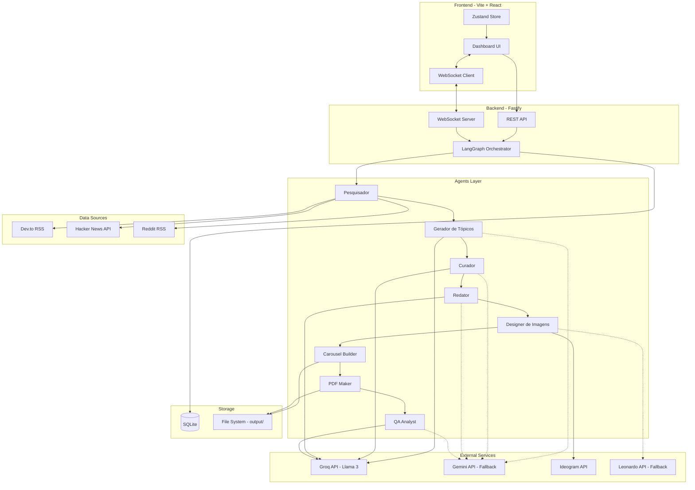
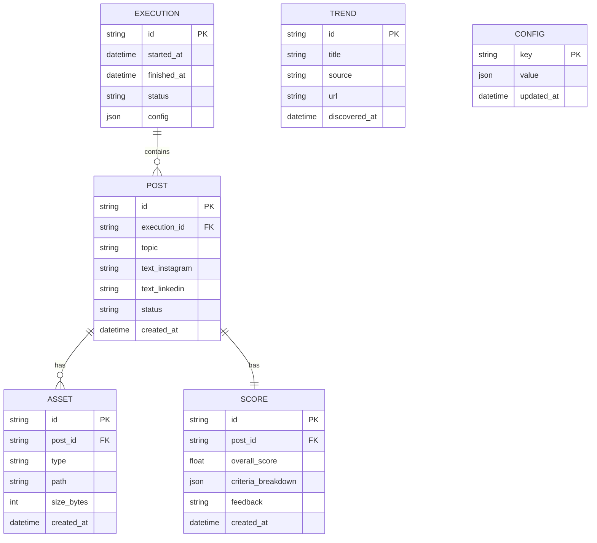
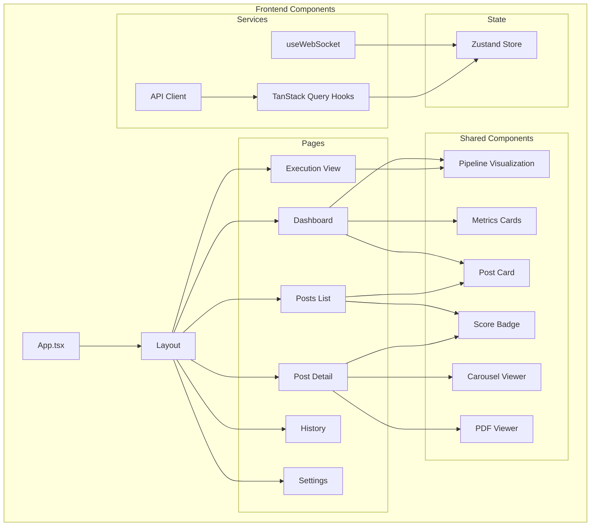
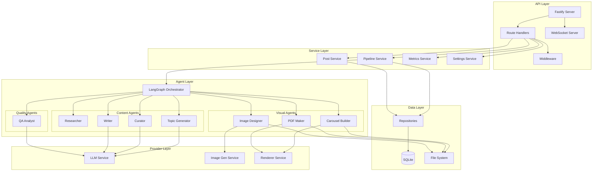
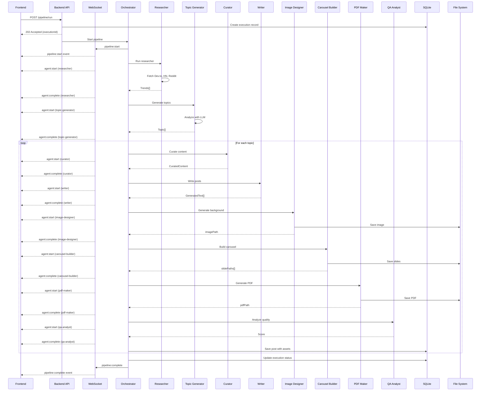
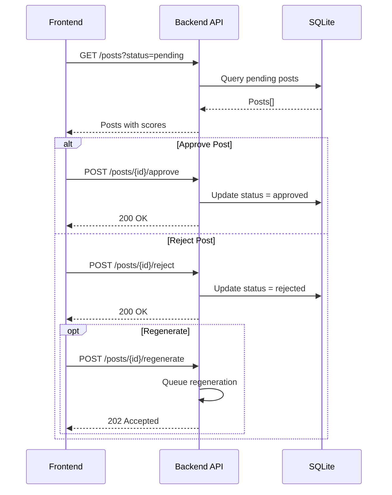

# Social Content Agent — Fullstack Architecture Document

> Arquitetura completa do sistema multi-agente para automação de conteúdo em redes sociais

---

## Introdução

Este documento define a arquitetura fullstack completa do Social Content Agent, um sistema multi-agente que automatiza a criação de conteúdo para Instagram e LinkedIn. A arquitetura foi projetada para:

- Orquestrar 9 agentes especializados de forma eficiente
- Processar texto e gerar assets visuais (imagens, carrosséis, PDFs)
- Fornecer interface web para monitoramento em tempo real
- Operar com custo zero usando apenas APIs gratuitas
- Executar localmente sem dependências de cloud

### Starter Template

**N/A — Projeto Greenfield**

O projeto será construído do zero usando as tecnologias definidas no PRD, sem uso de starter templates. A estrutura seguirá padrões estabelecidos de monorepo com pnpm workspaces.

### Change Log

| Data | Versão | Descrição | Autor |
|------|--------|-----------|-------|
| 2025-01-28 | 1.0 | Arquitetura inicial | Aria (Architect Agent) |

---

## High Level Architecture

### Technical Summary

O Social Content Agent é uma aplicação fullstack monolítica modular, executada localmente, que combina um backend Node.js/Fastify com um frontend React/Vite. O sistema utiliza LangGraph.js para orquestrar 9 agentes especializados que formam um pipeline de geração de conteúdo. A comunicação em tempo real entre frontend e backend é feita via WebSocket nativo, enquanto a persistência utiliza SQLite para simplicidade e portabilidade. A arquitetura prioriza execução local com custo zero, utilizando exclusivamente APIs gratuitas de LLM (Groq/Gemini) e geração de imagens (Ideogram/Leonardo).

### Platform and Infrastructure Choice

**Plataforma:** Local-First (Self-Hosted)

| Aspecto | Escolha | Rationale |
|---------|---------|-----------|
| **Execução** | Máquina local (Node.js) | Custo zero, sem dependências de cloud |
| **Database** | SQLite | Zero config, portável, suficiente para uso pessoal |
| **File Storage** | Filesystem local | Simplicidade para armazenar imagens/PDFs |
| **Real-time** | WebSocket nativo | Leve, sem dependências extras |

**Considerações futuras (pós-MVP):**
- Migração para Vercel/Railway se houver necessidade de acesso remoto
- Upgrade para PostgreSQL se escalar para múltiplos usuários

### Repository Structure

**Estrutura:** Monorepo com pnpm workspaces

```
Monorepo Tool: pnpm workspaces (nativo, sem Turborepo/Nx)
Package Organization:
├── packages/agents    → Core dos agentes e orquestração
├── packages/api       → Backend Fastify + WebSocket
├── packages/ui        → Frontend Vite + React
└── packages/shared    → Tipos e utilitários compartilhados
```

### High Level Architecture Diagram



### Architectural Patterns

| Padrão | Descrição | Rationale |
|--------|-----------|-----------|
| **Monolith Modular** | Backend e frontend separados mas no mesmo repo | Simplicidade para projeto solo, fácil refatoração |
| **Multi-Agent Pipeline** | Agentes especializados orquestrados por LangGraph | Separação de concerns, fácil manutenção e teste |
| **Repository Pattern** | Abstração de acesso a dados | Facilita testes e futura migração de banco |
| **Provider Pattern** | Abstração de serviços externos (LLM, ImageGen) | Permite fallback e troca de providers |
| **Event-Driven Updates** | WebSocket para comunicação real-time | UI responsiva sem polling |
| **Component-Based UI** | React components com shadcn/ui | Reutilização e consistência visual |
| **Store Pattern** | Zustand para estado global | Simples, sem boilerplate do Redux |

---

## Tech Stack

### Technology Stack Table

| Categoria | Tecnologia | Versão | Propósito | Rationale |
|-----------|------------|--------|-----------|-----------|
| **Frontend Language** | TypeScript | 5.3+ | Type safety | Previne bugs, melhor DX |
| **Frontend Framework** | React | 18.2+ | UI components | Ecossistema maduro, hooks |
| **Build Tool** | Vite | 5.0+ | Dev server e build | HMR rápido, build otimizado |
| **UI Components** | shadcn/ui | latest | Design system | Acessível, customizável, dark mode |
| **CSS Framework** | Tailwind CSS | 3.4+ | Styling | Utility-first, produtivo |
| **State Management** | Zustand | 4.4+ | Estado global | Simples, sem boilerplate |
| **Data Fetching** | TanStack Query | 5.0+ | Server state | Cache, refetch, loading states |
| **Routing** | React Router | 6.20+ | Client routing | Maduro, bem documentado |
| **Backend Language** | TypeScript | 5.3+ | Type safety | Consistência com frontend |
| **Backend Framework** | Fastify | 4.24+ | HTTP server | Performance, TypeScript nativo |
| **Agent Orchestration** | LangGraph.js | 0.0.20+ | Multi-agent | TypeScript nativo, graphs |
| **Database** | SQLite | 3.40+ | Persistência | Zero config, portável |
| **ORM** | Drizzle ORM | 0.29+ | Database access | Type-safe, leve |
| **WebSocket** | ws | 8.14+ | Real-time | Nativo, sem overhead |
| **HTML Rendering** | Puppeteer | 21.6+ | Screenshot/PDF | Maduro, confiável |
| **Syntax Highlight** | Shiki | 0.14+ | Code highlighting | Server-side, temas bonitos |
| **Frontend Testing** | Vitest | 1.0+ | Unit tests | Rápido, compatível com Vite |
| **Backend Testing** | Vitest | 1.0+ | Unit/Integration | Consistência com frontend |
| **E2E Testing** | Playwright | 1.40+ | End-to-end | Cross-browser, confiável |
| **Linting** | ESLint | 8.55+ | Code quality | Padrão da indústria |
| **Formatting** | Prettier | 3.1+ | Code style | Consistência automática |
| **Package Manager** | pnpm | 8.12+ | Dependencies | Eficiente para monorepo |

---

## Data Models

### Core Entities



### TypeScript Interfaces

```typescript
// packages/shared/src/types/index.ts

// === Enums ===
export enum AgentStatus {
  IDLE = 'idle',
  RUNNING = 'running',
  SUCCESS = 'success',
  ERROR = 'error'
}

export enum ExecutionStatus {
  PENDING = 'pending',
  RUNNING = 'running',
  COMPLETED = 'completed',
  FAILED = 'failed',
  CANCELLED = 'cancelled'
}

export enum PostStatus {
  PENDING = 'pending',
  APPROVED = 'approved',
  REJECTED = 'rejected'
}

export enum AssetType {
  BACKGROUND_IMAGE = 'background_image',
  CAROUSEL_SLIDE = 'carousel_slide',
  PDF = 'pdf'
}

export enum Platform {
  INSTAGRAM = 'instagram',
  LINKEDIN = 'linkedin'
}

// === Core Entities ===
export interface Execution {
  id: string;
  startedAt: Date;
  finishedAt?: Date;
  status: ExecutionStatus;
  config: ExecutionConfig;
  postsGenerated: number;
  averageScore?: number;
}

export interface ExecutionConfig {
  numPosts: number;
  platforms: Platform[];
  includeVisual: boolean;
  qualityThreshold: number;
  sources: string[];
}

export interface Post {
  id: string;
  executionId: string;
  topic: Topic;
  textInstagram?: string;
  textLinkedin?: string;
  status: PostStatus;
  createdAt: Date;
  assets: Asset[];
  score?: Score;
}

export interface Asset {
  id: string;
  postId: string;
  type: AssetType;
  path: string;
  sizeBytes: number;
  createdAt: Date;
}

export interface Score {
  id: string;
  postId: string;
  overallScore: number;
  criteriaBreakdown: CriteriaScore[];
  feedback: string;
  approved: boolean;
  createdAt: Date;
}

export interface CriteriaScore {
  name: string;
  score: number;
  weight: number;
  feedback?: string;
}

// === Agent Types ===
export interface Trend {
  id: string;
  title: string;
  description?: string;
  source: string;
  url: string;
  discoveredAt: Date;
}

export interface Topic {
  id: string;
  title: string;
  description: string;
  engagementPotential: number;
  basedOnTrends: string[];
}

export interface CuratedContent {
  topicId: string;
  references: Reference[];
  codeExamples: CodeExample[];
  keyPoints: string[];
}

export interface Reference {
  title: string;
  url?: string;
  summary: string;
}

export interface CodeExample {
  language: string;
  code: string;
  explanation: string;
}

export interface GeneratedText {
  platform: Platform;
  content: string;
  hashtags: string[];
  characterCount: number;
}

export interface CarouselSlide {
  index: number;
  type: 'cover' | 'content' | 'code' | 'cta';
  title?: string;
  content?: string;
  code?: CodeExample;
  imagePath?: string;
}

// === WebSocket Events ===
export interface WSEvent {
  type: WSEventType;
  payload: unknown;
  timestamp: Date;
}

export enum WSEventType {
  PIPELINE_START = 'pipeline:start',
  AGENT_START = 'agent:start',
  AGENT_PROGRESS = 'agent:progress',
  AGENT_COMPLETE = 'agent:complete',
  AGENT_ERROR = 'agent:error',
  PIPELINE_COMPLETE = 'pipeline:complete'
}

export interface AgentEvent {
  agentId: string;
  agentName: string;
  status: AgentStatus;
  progress?: number;
  message?: string;
  data?: unknown;
}
```

---

## API Specification

### REST API (OpenAPI 3.0)

```yaml
openapi: 3.0.0
info:
  title: Social Content Agent API
  version: 1.0.0
  description: API para o sistema multi-agente de geração de conteúdo

servers:
  - url: http://localhost:3001/api
    description: Local development server

paths:
  /health:
    get:
      summary: Health check
      responses:
        '200':
          description: OK
          content:
            application/json:
              schema:
                type: object
                properties:
                  status:
                    type: string
                    example: ok
                  timestamp:
                    type: string
                    format: date-time

  /pipeline/run:
    post:
      summary: Execute full pipeline
      requestBody:
        required: true
        content:
          application/json:
            schema:
              $ref: '#/components/schemas/PipelineConfig'
      responses:
        '202':
          description: Pipeline started
          content:
            application/json:
              schema:
                $ref: '#/components/schemas/Execution'

  /pipeline/status/{executionId}:
    get:
      summary: Get pipeline status
      parameters:
        - name: executionId
          in: path
          required: true
          schema:
            type: string
      responses:
        '200':
          description: Execution status
          content:
            application/json:
              schema:
                $ref: '#/components/schemas/Execution'

  /pipeline/cancel/{executionId}:
    post:
      summary: Cancel running pipeline
      parameters:
        - name: executionId
          in: path
          required: true
          schema:
            type: string
      responses:
        '200':
          description: Pipeline cancelled

  /agents/researcher/run:
    post:
      summary: Run researcher agent
      responses:
        '202':
          description: Agent started

  /agents/researcher/results:
    get:
      summary: Get researcher results
      responses:
        '200':
          description: Trends list
          content:
            application/json:
              schema:
                type: array
                items:
                  $ref: '#/components/schemas/Trend'

  /posts:
    get:
      summary: List all posts
      parameters:
        - name: status
          in: query
          schema:
            type: string
            enum: [pending, approved, rejected]
        - name: platform
          in: query
          schema:
            type: string
            enum: [instagram, linkedin]
        - name: limit
          in: query
          schema:
            type: integer
            default: 20
        - name: offset
          in: query
          schema:
            type: integer
            default: 0
      responses:
        '200':
          description: Posts list
          content:
            application/json:
              schema:
                type: object
                properties:
                  data:
                    type: array
                    items:
                      $ref: '#/components/schemas/Post'
                  total:
                    type: integer

  /posts/{postId}:
    get:
      summary: Get post details
      parameters:
        - name: postId
          in: path
          required: true
          schema:
            type: string
      responses:
        '200':
          description: Post details
          content:
            application/json:
              schema:
                $ref: '#/components/schemas/Post'

  /posts/{postId}/approve:
    post:
      summary: Approve post
      parameters:
        - name: postId
          in: path
          required: true
          schema:
            type: string
      responses:
        '200':
          description: Post approved

  /posts/{postId}/reject:
    post:
      summary: Reject post
      parameters:
        - name: postId
          in: path
          required: true
          schema:
            type: string
      requestBody:
        content:
          application/json:
            schema:
              type: object
              properties:
                reason:
                  type: string
      responses:
        '200':
          description: Post rejected

  /posts/{postId}/regenerate:
    post:
      summary: Regenerate rejected post
      parameters:
        - name: postId
          in: path
          required: true
          schema:
            type: string
      responses:
        '202':
          description: Regeneration started

  /posts/{postId}/assets:
    get:
      summary: List post assets
      parameters:
        - name: postId
          in: path
          required: true
          schema:
            type: string
      responses:
        '200':
          description: Assets list
          content:
            application/json:
              schema:
                type: array
                items:
                  $ref: '#/components/schemas/Asset'

  /posts/{postId}/assets/{assetId}/download:
    get:
      summary: Download asset
      parameters:
        - name: postId
          in: path
          required: true
          schema:
            type: string
        - name: assetId
          in: path
          required: true
          schema:
            type: string
      responses:
        '200':
          description: Asset file
          content:
            application/octet-stream:
              schema:
                type: string
                format: binary

  /executions:
    get:
      summary: List executions history
      parameters:
        - name: limit
          in: query
          schema:
            type: integer
            default: 20
      responses:
        '200':
          description: Executions list
          content:
            application/json:
              schema:
                type: array
                items:
                  $ref: '#/components/schemas/Execution'

  /metrics:
    get:
      summary: Get aggregated metrics
      responses:
        '200':
          description: Metrics
          content:
            application/json:
              schema:
                $ref: '#/components/schemas/Metrics'

  /settings:
    get:
      summary: Get current settings
      responses:
        '200':
          description: Settings
          content:
            application/json:
              schema:
                $ref: '#/components/schemas/Settings'
    put:
      summary: Update settings
      requestBody:
        required: true
        content:
          application/json:
            schema:
              $ref: '#/components/schemas/Settings'
      responses:
        '200':
          description: Settings updated

components:
  schemas:
    PipelineConfig:
      type: object
      properties:
        numPosts:
          type: integer
          default: 3
        platforms:
          type: array
          items:
            type: string
            enum: [instagram, linkedin]
        includeVisual:
          type: boolean
          default: true
        qualityThreshold:
          type: number
          default: 6.0

    Execution:
      type: object
      properties:
        id:
          type: string
        startedAt:
          type: string
          format: date-time
        finishedAt:
          type: string
          format: date-time
        status:
          type: string
          enum: [pending, running, completed, failed, cancelled]
        config:
          $ref: '#/components/schemas/PipelineConfig'
        postsGenerated:
          type: integer
        averageScore:
          type: number

    Post:
      type: object
      properties:
        id:
          type: string
        executionId:
          type: string
        topic:
          $ref: '#/components/schemas/Topic'
        textInstagram:
          type: string
        textLinkedin:
          type: string
        status:
          type: string
          enum: [pending, approved, rejected]
        assets:
          type: array
          items:
            $ref: '#/components/schemas/Asset'
        score:
          $ref: '#/components/schemas/Score'

    Topic:
      type: object
      properties:
        id:
          type: string
        title:
          type: string
        description:
          type: string
        engagementPotential:
          type: number

    Asset:
      type: object
      properties:
        id:
          type: string
        type:
          type: string
          enum: [background_image, carousel_slide, pdf]
        path:
          type: string
        sizeBytes:
          type: integer

    Score:
      type: object
      properties:
        overallScore:
          type: number
        criteriaBreakdown:
          type: array
          items:
            type: object
            properties:
              name:
                type: string
              score:
                type: number
              feedback:
                type: string
        approved:
          type: boolean

    Trend:
      type: object
      properties:
        id:
          type: string
        title:
          type: string
        source:
          type: string
        url:
          type: string
        discoveredAt:
          type: string
          format: date-time

    Metrics:
      type: object
      properties:
        postsToday:
          type: integer
        averageScore:
          type: number
        approvalRate:
          type: number
        avgGenerationTime:
          type: number

    Settings:
      type: object
      properties:
        sources:
          type: object
          properties:
            devto:
              type: boolean
            hackernews:
              type: boolean
            reddit:
              type: boolean
        llmProvider:
          type: string
          enum: [groq, gemini]
        imageProvider:
          type: string
          enum: [ideogram, leonardo]
        qualityThreshold:
          type: number
        autoRetry:
          type: boolean
```

### WebSocket Events

```typescript
// WebSocket endpoint: ws://localhost:3001/ws

// Server → Client Events
interface PipelineStartEvent {
  type: 'pipeline:start';
  payload: {
    executionId: string;
    config: ExecutionConfig;
  };
}

interface AgentStartEvent {
  type: 'agent:start';
  payload: {
    executionId: string;
    agentId: string;
    agentName: string;
  };
}

interface AgentProgressEvent {
  type: 'agent:progress';
  payload: {
    executionId: string;
    agentId: string;
    progress: number; // 0-100
    message: string;
  };
}

interface AgentCompleteEvent {
  type: 'agent:complete';
  payload: {
    executionId: string;
    agentId: string;
    duration: number;
    result?: unknown;
  };
}

interface AgentErrorEvent {
  type: 'agent:error';
  payload: {
    executionId: string;
    agentId: string;
    error: string;
    willRetry: boolean;
  };
}

interface PipelineCompleteEvent {
  type: 'pipeline:complete';
  payload: {
    executionId: string;
    status: 'completed' | 'failed';
    postsGenerated: number;
    averageScore: number;
    duration: number;
  };
}
```

---

## Components

### Component Architecture



### Backend Components



### Component Details

#### LLM Service

```typescript
// packages/agents/src/services/llm.ts

interface LLMProvider {
  name: string;
  generate(messages: Message[], options: LLMOptions): Promise<string>;
  isAvailable(): Promise<boolean>;
}

interface LLMService {
  providers: LLMProvider[];
  generate(messages: Message[], options?: LLMOptions): Promise<string>;
}

// Responsabilidade: Abstração de LLM com fallback automático
// Interfaces: generate(), addProvider(), setPreferredProvider()
// Dependências: Groq SDK, Google Generative AI SDK
// Tech: TypeScript, rate limiting, circuit breaker
```

#### Image Gen Service

```typescript
// packages/agents/src/services/image-gen.ts

interface ImageProvider {
  name: string;
  generate(prompt: string, options: ImageOptions): Promise<Buffer>;
  isAvailable(): Promise<boolean>;
}

interface ImageGenService {
  providers: ImageProvider[];
  generate(prompt: string, options?: ImageOptions): Promise<string>; // returns path
}

// Responsabilidade: Geração de imagens com fallback
// Interfaces: generate(), getProviderStatus()
// Dependências: Ideogram API, Leonardo API
// Tech: TypeScript, file system, rate limiting
```

#### Renderer Service

```typescript
// packages/agents/src/services/renderer.ts

interface RendererService {
  renderToImage(html: string, options: RenderOptions): Promise<Buffer>;
  renderToPDF(html: string, options: PDFOptions): Promise<Buffer>;
  renderTemplate(template: string, data: TemplateData): string;
}

// Responsabilidade: Renderização de HTML para imagem/PDF
// Interfaces: renderToImage(), renderToPDF(), renderTemplate()
// Dependências: Puppeteer, Shiki
// Tech: Browser pool, template engine
```

---

## External APIs

### Groq API (LLM)

- **Purpose:** Geração de texto (tópicos, curadoria, redação, QA)
- **Documentation:** https://console.groq.com/docs
- **Base URL:** https://api.groq.com/openai/v1
- **Authentication:** Bearer token (GROQ_API_KEY)
- **Rate Limits:** 30 req/min, 14.4k tokens/min (free tier)

**Key Endpoints:**
- `POST /chat/completions` - Geração de texto com Llama 3

**Integration Notes:**
- Usar modelo `llama-3.1-70b-versatile` para qualidade
- Implementar retry com backoff exponencial
- Cachear respostas quando possível

### Google Gemini API (LLM Fallback)

- **Purpose:** Fallback para Groq
- **Documentation:** https://ai.google.dev/docs
- **Base URL:** https://generativelanguage.googleapis.com/v1beta
- **Authentication:** API Key (GEMINI_API_KEY)
- **Rate Limits:** 60 req/min, 1M tokens/dia (free tier)

**Key Endpoints:**
- `POST /models/gemini-pro:generateContent` - Geração de texto

### Ideogram API (Image Generation)

- **Purpose:** Geração de imagens de fundo
- **Documentation:** https://ideogram.ai/api
- **Base URL:** https://api.ideogram.ai
- **Authentication:** API Key (IDEOGRAM_API_KEY)
- **Rate Limits:** 25 imagens/dia (free tier)

**Key Endpoints:**
- `POST /generate` - Geração de imagem

### Leonardo.ai API (Image Fallback)

- **Purpose:** Fallback para Ideogram
- **Documentation:** https://docs.leonardo.ai
- **Base URL:** https://cloud.leonardo.ai/api/rest/v1
- **Authentication:** Bearer token (LEONARDO_API_KEY)
- **Rate Limits:** 150 tokens/dia (free tier)

**Key Endpoints:**
- `POST /generations` - Criar job de geração
- `GET /generations/{id}` - Buscar resultado

---

## Core Workflows

### Full Pipeline Execution



### Post Approval Flow



---

## Database Schema

### SQLite Schema

```sql
-- Executions table
CREATE TABLE executions (
    id TEXT PRIMARY KEY,
    started_at DATETIME NOT NULL DEFAULT CURRENT_TIMESTAMP,
    finished_at DATETIME,
    status TEXT NOT NULL DEFAULT 'pending'
        CHECK (status IN ('pending', 'running', 'completed', 'failed', 'cancelled')),
    config JSON NOT NULL,
    posts_generated INTEGER DEFAULT 0,
    average_score REAL
);

CREATE INDEX idx_executions_status ON executions(status);
CREATE INDEX idx_executions_started ON executions(started_at DESC);

-- Posts table
CREATE TABLE posts (
    id TEXT PRIMARY KEY,
    execution_id TEXT NOT NULL REFERENCES executions(id) ON DELETE CASCADE,
    topic JSON NOT NULL,
    text_instagram TEXT,
    text_linkedin TEXT,
    status TEXT NOT NULL DEFAULT 'pending'
        CHECK (status IN ('pending', 'approved', 'rejected')),
    created_at DATETIME NOT NULL DEFAULT CURRENT_TIMESTAMP,
    updated_at DATETIME NOT NULL DEFAULT CURRENT_TIMESTAMP
);

CREATE INDEX idx_posts_execution ON posts(execution_id);
CREATE INDEX idx_posts_status ON posts(status);
CREATE INDEX idx_posts_created ON posts(created_at DESC);

-- Assets table
CREATE TABLE assets (
    id TEXT PRIMARY KEY,
    post_id TEXT NOT NULL REFERENCES posts(id) ON DELETE CASCADE,
    type TEXT NOT NULL
        CHECK (type IN ('background_image', 'carousel_slide', 'pdf')),
    path TEXT NOT NULL,
    size_bytes INTEGER NOT NULL,
    slide_index INTEGER, -- For carousel slides
    created_at DATETIME NOT NULL DEFAULT CURRENT_TIMESTAMP
);

CREATE INDEX idx_assets_post ON assets(post_id);
CREATE INDEX idx_assets_type ON assets(type);

-- Scores table
CREATE TABLE scores (
    id TEXT PRIMARY KEY,
    post_id TEXT NOT NULL UNIQUE REFERENCES posts(id) ON DELETE CASCADE,
    overall_score REAL NOT NULL,
    criteria_breakdown JSON NOT NULL,
    feedback TEXT,
    approved INTEGER NOT NULL DEFAULT 0,
    created_at DATETIME NOT NULL DEFAULT CURRENT_TIMESTAMP
);

CREATE INDEX idx_scores_post ON scores(post_id);
CREATE INDEX idx_scores_overall ON scores(overall_score);

-- Trends table (cache)
CREATE TABLE trends (
    id TEXT PRIMARY KEY,
    title TEXT NOT NULL,
    description TEXT,
    source TEXT NOT NULL,
    url TEXT NOT NULL,
    discovered_at DATETIME NOT NULL DEFAULT CURRENT_TIMESTAMP,
    expires_at DATETIME NOT NULL
);

CREATE INDEX idx_trends_source ON trends(source);
CREATE INDEX idx_trends_discovered ON trends(discovered_at DESC);
CREATE INDEX idx_trends_expires ON trends(expires_at);

-- Config table
CREATE TABLE config (
    key TEXT PRIMARY KEY,
    value JSON NOT NULL,
    updated_at DATETIME NOT NULL DEFAULT CURRENT_TIMESTAMP
);

-- Triggers for updated_at
CREATE TRIGGER update_posts_timestamp
    AFTER UPDATE ON posts
    BEGIN
        UPDATE posts SET updated_at = CURRENT_TIMESTAMP WHERE id = NEW.id;
    END;

CREATE TRIGGER update_config_timestamp
    AFTER UPDATE ON config
    BEGIN
        UPDATE config SET updated_at = CURRENT_TIMESTAMP WHERE key = NEW.key;
    END;
```

### Drizzle ORM Schema

```typescript
// packages/api/src/db/schema.ts
import { sqliteTable, text, integer, real } from 'drizzle-orm/sqlite-core';

export const executions = sqliteTable('executions', {
  id: text('id').primaryKey(),
  startedAt: integer('started_at', { mode: 'timestamp' }).notNull().defaultNow(),
  finishedAt: integer('finished_at', { mode: 'timestamp' }),
  status: text('status', { enum: ['pending', 'running', 'completed', 'failed', 'cancelled'] })
    .notNull()
    .default('pending'),
  config: text('config', { mode: 'json' }).notNull(),
  postsGenerated: integer('posts_generated').default(0),
  averageScore: real('average_score'),
});

export const posts = sqliteTable('posts', {
  id: text('id').primaryKey(),
  executionId: text('execution_id').notNull().references(() => executions.id),
  topic: text('topic', { mode: 'json' }).notNull(),
  textInstagram: text('text_instagram'),
  textLinkedin: text('text_linkedin'),
  status: text('status', { enum: ['pending', 'approved', 'rejected'] })
    .notNull()
    .default('pending'),
  createdAt: integer('created_at', { mode: 'timestamp' }).notNull().defaultNow(),
  updatedAt: integer('updated_at', { mode: 'timestamp' }).notNull().defaultNow(),
});

export const assets = sqliteTable('assets', {
  id: text('id').primaryKey(),
  postId: text('post_id').notNull().references(() => posts.id),
  type: text('type', { enum: ['background_image', 'carousel_slide', 'pdf'] }).notNull(),
  path: text('path').notNull(),
  sizeBytes: integer('size_bytes').notNull(),
  slideIndex: integer('slide_index'),
  createdAt: integer('created_at', { mode: 'timestamp' }).notNull().defaultNow(),
});

export const scores = sqliteTable('scores', {
  id: text('id').primaryKey(),
  postId: text('post_id').notNull().unique().references(() => posts.id),
  overallScore: real('overall_score').notNull(),
  criteriaBreakdown: text('criteria_breakdown', { mode: 'json' }).notNull(),
  feedback: text('feedback'),
  approved: integer('approved', { mode: 'boolean' }).notNull().default(false),
  createdAt: integer('created_at', { mode: 'timestamp' }).notNull().defaultNow(),
});

export const trends = sqliteTable('trends', {
  id: text('id').primaryKey(),
  title: text('title').notNull(),
  description: text('description'),
  source: text('source').notNull(),
  url: text('url').notNull(),
  discoveredAt: integer('discovered_at', { mode: 'timestamp' }).notNull().defaultNow(),
  expiresAt: integer('expires_at', { mode: 'timestamp' }).notNull(),
});

export const config = sqliteTable('config', {
  key: text('key').primaryKey(),
  value: text('value', { mode: 'json' }).notNull(),
  updatedAt: integer('updated_at', { mode: 'timestamp' }).notNull().defaultNow(),
});
```

---

## Frontend Architecture

### Component Organization

```
packages/ui/src/
├── main.tsx                    # Entry point
├── App.tsx                     # Root component + Router
├── routes/                     # Page components
│   ├── Dashboard.tsx
│   ├── Execution.tsx
│   ├── Posts.tsx
│   ├── PostDetail.tsx
│   ├── History.tsx
│   └── Settings.tsx
├── components/
│   ├── ui/                     # shadcn/ui components
│   │   ├── button.tsx
│   │   ├── card.tsx
│   │   ├── dialog.tsx
│   │   └── ...
│   ├── layout/
│   │   ├── Sidebar.tsx
│   │   ├── Header.tsx
│   │   └── Layout.tsx
│   ├── pipeline/
│   │   ├── PipelineVisualization.tsx
│   │   ├── AgentNode.tsx
│   │   └── LogViewer.tsx
│   ├── posts/
│   │   ├── PostCard.tsx
│   │   ├── PostGrid.tsx
│   │   ├── CarouselViewer.tsx
│   │   └── PDFViewer.tsx
│   └── metrics/
│       ├── MetricsCard.tsx
│       ├── ScoreChart.tsx
│       └── TrendChart.tsx
├── hooks/
│   ├── useWebSocket.ts
│   ├── usePipeline.ts
│   ├── usePosts.ts
│   └── useMetrics.ts
├── stores/
│   └── app.store.ts
├── lib/
│   ├── api.ts                  # API client
│   ├── utils.ts
│   └── constants.ts
└── styles/
    └── globals.css
```

### State Management

```typescript
// packages/ui/src/stores/app.store.ts
import { create } from 'zustand';

interface PipelineState {
  isRunning: boolean;
  currentExecution: Execution | null;
  agentStatuses: Record<string, AgentStatus>;
  logs: LogEntry[];
}

interface AppState {
  // Connection
  isConnected: boolean;
  setConnected: (connected: boolean) => void;

  // Pipeline
  pipeline: PipelineState;
  setPipelineRunning: (running: boolean) => void;
  setCurrentExecution: (execution: Execution | null) => void;
  updateAgentStatus: (agentId: string, status: AgentStatus) => void;
  addLog: (log: LogEntry) => void;
  clearLogs: () => void;

  // UI State
  sidebarOpen: boolean;
  toggleSidebar: () => void;
}

export const useAppStore = create<AppState>((set) => ({
  // Connection
  isConnected: false,
  setConnected: (connected) => set({ isConnected: connected }),

  // Pipeline
  pipeline: {
    isRunning: false,
    currentExecution: null,
    agentStatuses: {},
    logs: [],
  },
  setPipelineRunning: (running) =>
    set((state) => ({
      pipeline: { ...state.pipeline, isRunning: running }
    })),
  setCurrentExecution: (execution) =>
    set((state) => ({
      pipeline: { ...state.pipeline, currentExecution: execution }
    })),
  updateAgentStatus: (agentId, status) =>
    set((state) => ({
      pipeline: {
        ...state.pipeline,
        agentStatuses: { ...state.pipeline.agentStatuses, [agentId]: status },
      },
    })),
  addLog: (log) =>
    set((state) => ({
      pipeline: {
        ...state.pipeline,
        logs: [...state.pipeline.logs, log].slice(-100), // Keep last 100
      },
    })),
  clearLogs: () =>
    set((state) => ({
      pipeline: { ...state.pipeline, logs: [] },
    })),

  // UI
  sidebarOpen: true,
  toggleSidebar: () => set((state) => ({ sidebarOpen: !state.sidebarOpen })),
}));
```

### Routing Architecture

```typescript
// packages/ui/src/App.tsx
import { BrowserRouter, Routes, Route, Navigate } from 'react-router-dom';
import { QueryClient, QueryClientProvider } from '@tanstack/react-query';
import { Layout } from './components/layout/Layout';
import { Dashboard } from './routes/Dashboard';
import { Execution } from './routes/Execution';
import { Posts } from './routes/Posts';
import { PostDetail } from './routes/PostDetail';
import { History } from './routes/History';
import { Settings } from './routes/Settings';

const queryClient = new QueryClient({
  defaultOptions: {
    queries: {
      staleTime: 30 * 1000, // 30 seconds
      refetchOnWindowFocus: false,
    },
  },
});

export function App() {
  return (
    <QueryClientProvider client={queryClient}>
      <BrowserRouter>
        <Routes>
          <Route path="/" element={<Layout />}>
            <Route index element={<Dashboard />} />
            <Route path="execution" element={<Execution />} />
            <Route path="execution/:id" element={<Execution />} />
            <Route path="posts" element={<Posts />} />
            <Route path="posts/:id" element={<PostDetail />} />
            <Route path="history" element={<History />} />
            <Route path="settings" element={<Settings />} />
            <Route path="*" element={<Navigate to="/" replace />} />
          </Route>
        </Routes>
      </BrowserRouter>
    </QueryClientProvider>
  );
}
```

### API Client

```typescript
// packages/ui/src/lib/api.ts
const API_BASE = import.meta.env.VITE_API_URL || 'http://localhost:3001/api';

class ApiClient {
  private baseUrl: string;

  constructor(baseUrl: string) {
    this.baseUrl = baseUrl;
  }

  private async request<T>(
    endpoint: string,
    options: RequestInit = {}
  ): Promise<T> {
    const url = `${this.baseUrl}${endpoint}`;
    const response = await fetch(url, {
      ...options,
      headers: {
        'Content-Type': 'application/json',
        ...options.headers,
      },
    });

    if (!response.ok) {
      const error = await response.json().catch(() => ({}));
      throw new ApiError(response.status, error.message || 'Request failed');
    }

    return response.json();
  }

  // Pipeline
  async runPipeline(config: PipelineConfig): Promise<Execution> {
    return this.request('/pipeline/run', {
      method: 'POST',
      body: JSON.stringify(config),
    });
  }

  async getPipelineStatus(executionId: string): Promise<Execution> {
    return this.request(`/pipeline/status/${executionId}`);
  }

  async cancelPipeline(executionId: string): Promise<void> {
    return this.request(`/pipeline/cancel/${executionId}`, { method: 'POST' });
  }

  // Posts
  async getPosts(params?: PostsQuery): Promise<PaginatedResponse<Post>> {
    const query = new URLSearchParams(params as Record<string, string>);
    return this.request(`/posts?${query}`);
  }

  async getPost(id: string): Promise<Post> {
    return this.request(`/posts/${id}`);
  }

  async approvePost(id: string): Promise<void> {
    return this.request(`/posts/${id}/approve`, { method: 'POST' });
  }

  async rejectPost(id: string, reason?: string): Promise<void> {
    return this.request(`/posts/${id}/reject`, {
      method: 'POST',
      body: JSON.stringify({ reason }),
    });
  }

  async regeneratePost(id: string): Promise<void> {
    return this.request(`/posts/${id}/regenerate`, { method: 'POST' });
  }

  // Assets
  async getAssets(postId: string): Promise<Asset[]> {
    return this.request(`/posts/${postId}/assets`);
  }

  getAssetDownloadUrl(postId: string, assetId: string): string {
    return `${this.baseUrl}/posts/${postId}/assets/${assetId}/download`;
  }

  // Executions
  async getExecutions(limit?: number): Promise<Execution[]> {
    const query = limit ? `?limit=${limit}` : '';
    return this.request(`/executions${query}`);
  }

  // Metrics
  async getMetrics(): Promise<Metrics> {
    return this.request('/metrics');
  }

  // Settings
  async getSettings(): Promise<Settings> {
    return this.request('/settings');
  }

  async updateSettings(settings: Settings): Promise<void> {
    return this.request('/settings', {
      method: 'PUT',
      body: JSON.stringify(settings),
    });
  }
}

export const api = new ApiClient(API_BASE);
```

---

## Backend Architecture

### Service Architecture

```
packages/api/src/
├── index.ts                    # Entry point
├── server.ts                   # Fastify setup
├── routes/
│   ├── index.ts                # Route registration
│   ├── health.ts
│   ├── pipeline.ts
│   ├── posts.ts
│   ├── executions.ts
│   ├── metrics.ts
│   └── settings.ts
├── services/
│   ├── pipeline.service.ts
│   ├── post.service.ts
│   ├── metrics.service.ts
│   └── settings.service.ts
├── websocket/
│   ├── server.ts               # WS setup
│   ├── handlers.ts
│   └── events.ts
├── db/
│   ├── client.ts               # Drizzle client
│   ├── schema.ts               # Schema definitions
│   └── migrate.ts              # Migrations
├── repositories/
│   ├── execution.repo.ts
│   ├── post.repo.ts
│   ├── asset.repo.ts
│   ├── score.repo.ts
│   └── config.repo.ts
├── middleware/
│   ├── error-handler.ts
│   ├── logger.ts
│   └── cors.ts
└── utils/
    ├── id.ts
    └── date.ts
```

### Controller Template

```typescript
// packages/api/src/routes/pipeline.ts
import { FastifyInstance } from 'fastify';
import { PipelineService } from '../services/pipeline.service';
import { PipelineConfigSchema, ExecutionIdSchema } from '@social-content/shared';

export async function pipelineRoutes(fastify: FastifyInstance) {
  const pipelineService = new PipelineService(fastify);

  // Run full pipeline
  fastify.post('/pipeline/run', {
    schema: {
      body: PipelineConfigSchema,
    },
    handler: async (request, reply) => {
      const config = request.body;
      const execution = await pipelineService.run(config);
      return reply.status(202).send(execution);
    },
  });

  // Get pipeline status
  fastify.get('/pipeline/status/:executionId', {
    schema: {
      params: ExecutionIdSchema,
    },
    handler: async (request, reply) => {
      const { executionId } = request.params;
      const execution = await pipelineService.getStatus(executionId);
      if (!execution) {
        return reply.status(404).send({ error: 'Execution not found' });
      }
      return execution;
    },
  });

  // Cancel pipeline
  fastify.post('/pipeline/cancel/:executionId', {
    schema: {
      params: ExecutionIdSchema,
    },
    handler: async (request, reply) => {
      const { executionId } = request.params;
      await pipelineService.cancel(executionId);
      return { success: true };
    },
  });
}
```

### Data Access Layer

```typescript
// packages/api/src/repositories/post.repo.ts
import { eq, desc, and, sql } from 'drizzle-orm';
import { db } from '../db/client';
import { posts, assets, scores } from '../db/schema';
import { Post, PostStatus, CreatePostInput } from '@social-content/shared';
import { generateId } from '../utils/id';

export class PostRepository {
  async create(input: CreatePostInput): Promise<Post> {
    const id = generateId();
    const now = new Date();

    await db.insert(posts).values({
      id,
      executionId: input.executionId,
      topic: JSON.stringify(input.topic),
      textInstagram: input.textInstagram,
      textLinkedin: input.textLinkedin,
      status: 'pending',
      createdAt: now,
      updatedAt: now,
    });

    return this.findById(id)!;
  }

  async findById(id: string): Promise<Post | null> {
    const result = await db
      .select()
      .from(posts)
      .leftJoin(scores, eq(posts.id, scores.postId))
      .where(eq(posts.id, id))
      .limit(1);

    if (!result.length) return null;

    const post = result[0].posts;
    const score = result[0].scores;

    const postAssets = await db
      .select()
      .from(assets)
      .where(eq(assets.postId, id));

    return this.mapToPost(post, postAssets, score);
  }

  async findByStatus(status: PostStatus, limit = 20, offset = 0): Promise<Post[]> {
    const result = await db
      .select()
      .from(posts)
      .leftJoin(scores, eq(posts.id, scores.postId))
      .where(eq(posts.status, status))
      .orderBy(desc(posts.createdAt))
      .limit(limit)
      .offset(offset);

    return Promise.all(
      result.map(async (r) => {
        const postAssets = await db
          .select()
          .from(assets)
          .where(eq(assets.postId, r.posts.id));
        return this.mapToPost(r.posts, postAssets, r.scores);
      })
    );
  }

  async updateStatus(id: string, status: PostStatus): Promise<void> {
    await db
      .update(posts)
      .set({ status, updatedAt: new Date() })
      .where(eq(posts.id, id));
  }

  async countByStatus(): Promise<Record<PostStatus, number>> {
    const result = await db
      .select({
        status: posts.status,
        count: sql<number>`count(*)`,
      })
      .from(posts)
      .groupBy(posts.status);

    return result.reduce(
      (acc, r) => ({ ...acc, [r.status]: r.count }),
      { pending: 0, approved: 0, rejected: 0 }
    );
  }

  private mapToPost(post: any, assets: any[], score: any | null): Post {
    return {
      id: post.id,
      executionId: post.executionId,
      topic: JSON.parse(post.topic),
      textInstagram: post.textInstagram,
      textLinkedin: post.textLinkedin,
      status: post.status,
      createdAt: post.createdAt,
      assets: assets.map((a) => ({
        id: a.id,
        postId: a.postId,
        type: a.type,
        path: a.path,
        sizeBytes: a.sizeBytes,
        createdAt: a.createdAt,
      })),
      score: score
        ? {
            id: score.id,
            postId: score.postId,
            overallScore: score.overallScore,
            criteriaBreakdown: JSON.parse(score.criteriaBreakdown),
            feedback: score.feedback,
            approved: Boolean(score.approved),
            createdAt: score.createdAt,
          }
        : undefined,
    };
  }
}
```

---

## Unified Project Structure

```
social-content-agent/
├── .github/
│   └── workflows/
│       └── ci.yaml                 # Lint, test, build
├── packages/
│   ├── agents/                     # Agent implementations
│   │   ├── src/
│   │   │   ├── agents/
│   │   │   │   ├── researcher.ts
│   │   │   │   ├── topic-generator.ts
│   │   │   │   ├── curator.ts
│   │   │   │   ├── writer.ts
│   │   │   │   ├── image-designer.ts
│   │   │   │   ├── carousel-builder.ts
│   │   │   │   ├── pdf-maker.ts
│   │   │   │   ├── qa-analyst.ts
│   │   │   │   └── index.ts
│   │   │   ├── services/
│   │   │   │   ├── llm/
│   │   │   │   │   ├── llm.service.ts
│   │   │   │   │   ├── groq.provider.ts
│   │   │   │   │   └── gemini.provider.ts
│   │   │   │   ├── image/
│   │   │   │   │   ├── image.service.ts
│   │   │   │   │   ├── ideogram.provider.ts
│   │   │   │   │   └── leonardo.provider.ts
│   │   │   │   └── renderer/
│   │   │   │       ├── renderer.service.ts
│   │   │   │       └── templates.ts
│   │   │   ├── orchestrator/
│   │   │   │   ├── graph.ts
│   │   │   │   ├── state.ts
│   │   │   │   └── nodes.ts
│   │   │   └── index.ts
│   │   ├── package.json
│   │   └── tsconfig.json
│   │
│   ├── api/                        # Backend Fastify
│   │   ├── src/
│   │   │   ├── routes/
│   │   │   │   ├── health.ts
│   │   │   │   ├── pipeline.ts
│   │   │   │   ├── posts.ts
│   │   │   │   ├── executions.ts
│   │   │   │   ├── metrics.ts
│   │   │   │   ├── settings.ts
│   │   │   │   └── index.ts
│   │   │   ├── services/
│   │   │   │   ├── pipeline.service.ts
│   │   │   │   ├── post.service.ts
│   │   │   │   ├── metrics.service.ts
│   │   │   │   └── settings.service.ts
│   │   │   ├── websocket/
│   │   │   │   ├── server.ts
│   │   │   │   └── events.ts
│   │   │   ├── db/
│   │   │   │   ├── client.ts
│   │   │   │   ├── schema.ts
│   │   │   │   └── migrations/
│   │   │   ├── repositories/
│   │   │   │   ├── execution.repo.ts
│   │   │   │   ├── post.repo.ts
│   │   │   │   ├── asset.repo.ts
│   │   │   │   └── score.repo.ts
│   │   │   ├── middleware/
│   │   │   │   ├── error-handler.ts
│   │   │   │   └── logger.ts
│   │   │   ├── server.ts
│   │   │   └── index.ts
│   │   ├── package.json
│   │   └── tsconfig.json
│   │
│   ├── ui/                         # Frontend Vite + React
│   │   ├── src/
│   │   │   ├── routes/
│   │   │   │   ├── Dashboard.tsx
│   │   │   │   ├── Execution.tsx
│   │   │   │   ├── Posts.tsx
│   │   │   │   ├── PostDetail.tsx
│   │   │   │   ├── History.tsx
│   │   │   │   └── Settings.tsx
│   │   │   ├── components/
│   │   │   │   ├── ui/             # shadcn/ui
│   │   │   │   ├── layout/
│   │   │   │   ├── pipeline/
│   │   │   │   ├── posts/
│   │   │   │   └── metrics/
│   │   │   ├── hooks/
│   │   │   │   ├── useWebSocket.ts
│   │   │   │   ├── usePipeline.ts
│   │   │   │   └── usePosts.ts
│   │   │   ├── stores/
│   │   │   │   └── app.store.ts
│   │   │   ├── lib/
│   │   │   │   ├── api.ts
│   │   │   │   └── utils.ts
│   │   │   ├── styles/
│   │   │   │   └── globals.css
│   │   │   ├── App.tsx
│   │   │   └── main.tsx
│   │   ├── public/
│   │   ├── index.html
│   │   ├── vite.config.ts
│   │   ├── tailwind.config.js
│   │   ├── postcss.config.js
│   │   ├── package.json
│   │   └── tsconfig.json
│   │
│   └── shared/                     # Shared types and utils
│       ├── src/
│       │   ├── types/
│       │   │   ├── agents.ts
│       │   │   ├── entities.ts
│       │   │   ├── events.ts
│       │   │   └── index.ts
│       │   ├── utils/
│       │   │   ├── logger.ts
│       │   │   ├── retry.ts
│       │   │   └── rate-limiter.ts
│       │   ├── constants/
│       │   │   └── index.ts
│       │   └── index.ts
│       ├── package.json
│       └── tsconfig.json
│
├── templates/                      # HTML/CSS templates
│   ├── carousel/
│   │   ├── cover.html
│   │   ├── content.html
│   │   ├── code.html
│   │   ├── cta.html
│   │   └── styles.css
│   └── pdf/
│       └── document.html
│
├── output/                         # Generated content (gitignored)
│   └── .gitkeep
│
├── docs/
│   ├── brief.md
│   ├── prd.md
│   └── architecture.md
│
├── scripts/
│   └── setup.sh
│
├── .env.example
├── .gitignore
├── .eslintrc.js
├── .prettierrc
├── pnpm-workspace.yaml
├── package.json
├── tsconfig.base.json
└── README.md
```

---

## Development Workflow

### Prerequisites

```bash
# Required
node >= 20.0.0
pnpm >= 8.12.0

# Optional (for local image gen)
# Docker (if running Stable Diffusion locally)
```

### Initial Setup

```bash
# Clone repository
git clone <repo-url>
cd social-content-agent

# Install dependencies
pnpm install

# Copy environment file
cp .env.example .env

# Edit .env with your API keys
# GROQ_API_KEY=...
# GEMINI_API_KEY=...
# IDEOGRAM_API_KEY=...
# LEONARDO_API_KEY=...

# Initialize database
pnpm db:migrate

# Start development
pnpm dev
```

### Development Commands

```bash
# Start all services (frontend + backend)
pnpm dev

# Start frontend only
pnpm dev:ui

# Start backend only
pnpm dev:api

# Run tests
pnpm test

# Run tests with coverage
pnpm test:coverage

# Lint
pnpm lint

# Format
pnpm format

# Type check
pnpm typecheck

# Build all packages
pnpm build

# Database migrations
pnpm db:migrate
pnpm db:generate
pnpm db:studio
```

### Environment Variables

```bash
# .env

# === Server ===
PORT=3001
NODE_ENV=development

# === Database ===
DATABASE_URL=file:./data/social-content.db

# === LLM Providers ===
GROQ_API_KEY=your_groq_api_key
GEMINI_API_KEY=your_gemini_api_key

# === Image Providers ===
IDEOGRAM_API_KEY=your_ideogram_api_key
LEONARDO_API_KEY=your_leonardo_api_key

# === Defaults ===
DEFAULT_LLM_PROVIDER=groq
DEFAULT_IMAGE_PROVIDER=ideogram
QUALITY_THRESHOLD=6.0

# === Frontend (packages/ui/.env.local) ===
VITE_API_URL=http://localhost:3001/api
VITE_WS_URL=ws://localhost:3001/ws
```

---

## Deployment Architecture

### Local Deployment (MVP)

```
┌─────────────────────────────────────────────┐
│              Developer Machine              │
├─────────────────────────────────────────────┤
│                                             │
│  ┌─────────────────┐  ┌─────────────────┐  │
│  │   Frontend      │  │    Backend      │  │
│  │   (Vite dev)    │  │   (tsx watch)   │  │
│  │   :5173         │  │   :3001         │  │
│  └────────┬────────┘  └────────┬────────┘  │
│           │                    │            │
│           └────────┬───────────┘            │
│                    │                        │
│           ┌────────▼────────┐               │
│           │    SQLite DB    │               │
│           │   ./data/*.db   │               │
│           └─────────────────┘               │
│                                             │
│           ┌─────────────────┐               │
│           │   File System   │               │
│           │    ./output/    │               │
│           └─────────────────┘               │
│                                             │
└─────────────────────────────────────────────┘
```

### Production Build

```bash
# Build all packages
pnpm build

# Start production server
pnpm start

# Or use PM2
pm2 start ecosystem.config.js
```

### Environments

| Environment | Frontend URL | Backend URL | Purpose |
|-------------|--------------|-------------|---------|
| Development | http://localhost:5173 | http://localhost:3001 | Local development |
| Production | http://localhost:3001 | http://localhost:3001 | Self-hosted production |

---

## Security and Performance

### Security Requirements

**Backend Security:**
- Input Validation: Zod schemas on all endpoints
- Rate Limiting: Per-endpoint rate limits
- CORS: Restrictive policy (localhost only in dev)
- Environment: Secrets via environment variables only

**API Key Security:**
- All API keys stored in `.env` (gitignored)
- Keys never logged or exposed in responses
- Rate limit monitoring to avoid abuse

### Performance Optimization

**Frontend Performance:**
- Bundle Size Target: < 200KB gzipped
- Loading Strategy: Lazy load routes, code splitting
- Caching: TanStack Query with 30s stale time

**Backend Performance:**
- Response Time Target: < 500ms for API calls
- Database: SQLite with proper indexes
- Caching: In-memory cache for trends (15 min TTL)

**Agent Performance:**
- Parallel execution where possible
- Rate limit aware scheduling
- Retry with exponential backoff

---

## Testing Strategy

### Test Pyramid

```
           E2E Tests (Playwright)
          /                      \
     Integration Tests (Vitest)
        /                    \
   Frontend Unit         Backend Unit
   (Vitest + RTL)        (Vitest)
```

### Test Organization

```
packages/
├── agents/
│   └── src/
│       └── __tests__/
│           ├── agents/
│           │   ├── researcher.test.ts
│           │   └── writer.test.ts
│           └── services/
│               ├── llm.test.ts
│               └── image.test.ts
├── api/
│   └── src/
│       └── __tests__/
│           ├── routes/
│           │   ├── pipeline.test.ts
│           │   └── posts.test.ts
│           └── repositories/
│               └── post.repo.test.ts
├── ui/
│   └── src/
│       └── __tests__/
│           ├── components/
│           │   └── PostCard.test.tsx
│           └── hooks/
│               └── usePipeline.test.ts
└── e2e/
    └── tests/
        ├── pipeline.spec.ts
        └── posts.spec.ts
```

---

## Coding Standards

### Critical Fullstack Rules

- **Type Sharing:** Always define types in `packages/shared` and import from there
- **API Calls:** Never make direct HTTP calls in components - use hooks with TanStack Query
- **Environment Variables:** Access only through config objects, never `process.env` directly
- **Error Handling:** All API routes must use the standard error handler middleware
- **State Updates:** Never mutate state directly - use Zustand actions
- **File Paths:** Use path.join() for all file operations, never string concatenation
- **Logging:** Use structured logger, never console.log in production code
- **IDs:** Use nanoid for all ID generation, never UUID

### Naming Conventions

| Element | Frontend | Backend | Example |
|---------|----------|---------|---------|
| Components | PascalCase | - | `PostCard.tsx` |
| Hooks | camelCase with 'use' | - | `usePipeline.ts` |
| Stores | camelCase with 'Store' | - | `app.store.ts` |
| API Routes | - | kebab-case | `/api/posts/{id}` |
| Database Tables | - | snake_case | `post_assets` |
| Types/Interfaces | PascalCase | PascalCase | `Post`, `Execution` |
| Enums | PascalCase | PascalCase | `PostStatus` |
| Constants | UPPER_SNAKE_CASE | UPPER_SNAKE_CASE | `MAX_RETRY_COUNT` |

---

## Error Handling Strategy

### Error Response Format

```typescript
interface ApiError {
  error: {
    code: string;
    message: string;
    details?: Record<string, unknown>;
    timestamp: string;
    requestId: string;
  };
}

// Error codes
enum ErrorCode {
  VALIDATION_ERROR = 'VALIDATION_ERROR',
  NOT_FOUND = 'NOT_FOUND',
  RATE_LIMITED = 'RATE_LIMITED',
  PROVIDER_ERROR = 'PROVIDER_ERROR',
  INTERNAL_ERROR = 'INTERNAL_ERROR',
}
```

### Backend Error Handler

```typescript
// packages/api/src/middleware/error-handler.ts
import { FastifyError, FastifyReply, FastifyRequest } from 'fastify';

export function errorHandler(
  error: FastifyError,
  request: FastifyRequest,
  reply: FastifyReply
) {
  const requestId = request.id;
  const timestamp = new Date().toISOString();

  // Log error
  request.log.error({ err: error, requestId }, 'Request error');

  // Determine status code
  const statusCode = error.statusCode || 500;

  // Build response
  const response: ApiError = {
    error: {
      code: error.code || 'INTERNAL_ERROR',
      message: error.message || 'An unexpected error occurred',
      details: error.validation || undefined,
      timestamp,
      requestId,
    },
  };

  reply.status(statusCode).send(response);
}
```

### Frontend Error Handling

```typescript
// packages/ui/src/lib/api.ts
export class ApiError extends Error {
  constructor(
    public status: number,
    message: string,
    public code?: string,
    public details?: Record<string, unknown>
  ) {
    super(message);
    this.name = 'ApiError';
  }
}

// Usage in components with error boundary
function PostsPage() {
  const { data, error, isLoading } = usePosts();

  if (error) {
    if (error instanceof ApiError && error.status === 404) {
      return <EmptyState message="No posts found" />;
    }
    throw error; // Let error boundary handle
  }

  // ...
}
```

---

## Monitoring and Observability

### Monitoring Stack

- **Frontend Monitoring:** (MVP: browser console, future: Sentry)
- **Backend Monitoring:** Pino structured logging
- **Error Tracking:** (MVP: file logs, future: Sentry)
- **Performance:** (MVP: manual timing, future: OpenTelemetry)

### Key Metrics

**Frontend Metrics:**
- Page load times
- API response times
- WebSocket connection status
- JavaScript errors

**Backend Metrics:**
- Request rate per endpoint
- Error rate per endpoint
- Agent execution times
- LLM/Image provider response times
- Database query times

### Logging Format

```typescript
// Structured log format
{
  "level": "info",
  "time": 1703123456789,
  "pid": 12345,
  "hostname": "localhost",
  "reqId": "abc-123",
  "msg": "Pipeline started",
  "executionId": "exec-456",
  "config": { "numPosts": 3 }
}
```

---

## Checklist Results

| # | Item | Status |
|---|------|--------|
| 1 | High-level architecture defined | ✅ |
| 2 | Tech stack finalized | ✅ |
| 3 | Data models documented | ✅ |
| 4 | API specification complete | ✅ |
| 5 | Database schema defined | ✅ |
| 6 | Frontend architecture documented | ✅ |
| 7 | Backend architecture documented | ✅ |
| 8 | Project structure defined | ✅ |
| 9 | Development workflow documented | ✅ |
| 10 | Security considerations addressed | ✅ |
| 11 | Testing strategy defined | ✅ |
| 12 | Coding standards established | ✅ |
| 13 | Error handling strategy defined | ✅ |
| 14 | External APIs documented | ✅ |

---

## Next Steps

### Handoff to Development

```
Este documento de arquitetura está pronto para guiar a implementação.

Próximos passos recomendados:
1. @dev - Iniciar Epic 1 (Setup do Monorepo)
2. @ux-design-expert - Criar design system detalhado
3. @sm - Revisar stories e criar sprint backlog

Documentos de referência:
- docs/brief.md - Contexto do projeto
- docs/prd.md - Requisitos e stories
- docs/architecture.md - Este documento
```

---

*Documento gerado com auxílio da Aria (Architect Agent) — Synkra AIOS*
