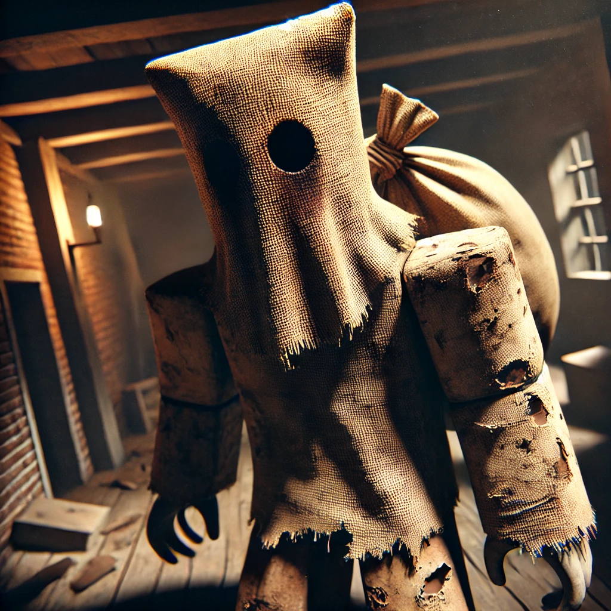

# Game Briefing: Sackman

## Conceito

**One-liner:** Sobreviva ao Sackman ou capture todas as crianças no celeiro amaldiçoado

**Gênero:** Horror Assimétrico Multiplayer (1v7 / 2v16)
**Target:** Todos (all ages)
**Inspiração:** Dead by Daylight, Identity V, Piggy

---

## O Vilão: Sackman

### Visual
- **Cabeça:** Saco de estopa com um único buraco de olho (assimetria perturbadora)
- **Corpo:** Alongado e distorcido, proporções "uncanny valley"
- **Vestimenta:** Roupas esfarrapadas e sujas, visual de abandono
- **Mãos:** Escuras como garras, ameaçadoras
- **Silhueta:** Reconhecível e icônica

### Referências Visuais
- Little Nightmares (proporções distorcidas)
- Scarecrow/Espantalho (saco na cabeça)
- Folclore do "homem do saco"

### Arte Conceitual


---

## Inspirações

- **Piggy** - Sistema de escape com perseguição
- **Granny** - Tensão de fuga em ambiente fechado
- Mecânica de puzzles para progressão

---

## Diferencial (USP)

### Por que Sackman é diferente?

1. **Escala maior** - 1v7 e 2v16 vs 1v4 típico (mais caos, mais diversão)
2. **Captura, não morte** - Crianças presas em sacos (family-friendly, temático)
3. **Sistema de Classes** - Múltiplas classes para Survivors E para Sackman
4. **O Sackman** - Vilão icônico com design único (homem do saco)
5. **Resgate constante** - Com 7-16 survivors, resgates são frequentes e estratégicos

---

## Modos de Jogo

| Modo | Jogadores | Duração |
|------|-----------|---------|
| **Clássico** | 1v7 | 12-15 min |
| **Caos** | 2v16 | 15-20 min |

## Core Loop

### Survivors (Crianças)

```
┌─────────────────────────────────────────────────────┐
│               SURVIVOR LOOP                          │
├─────────────────────────────────────────────────────┤
│                                                      │
│   [1] Encontrar CHAVES coloridas                     │
│        │                                             │
│        ▼                                             │
│   [2] Abrir SALAS da cor correspondente              │
│        │          ◄──── Sackman Persegue             │
│        ▼                     ▲                       │
│   [3] Coletar mais chaves + PEÇAS DO PUZZLE          │
│        │                     │                       │
│   [Capturado?]               │                       │
│    SIM │ NÃO ────────────────┘                       │
│     │                                                │
│     ▼                                                │
│   Preso em Saco → Levado ao Gancho                   │
│        │                                             │
│        ▼                                             │
│   Resgatado por aliado OU Eliminado                  │
│                                                      │
│   [4] Resolver PUZZLE FINAL na porta                 │
│        │                                             │
│        ▼                                             │
│   [5] 1 de 3 SAÍDAS abre → ESCAPE!                   │
└─────────────────────────────────────────────────────┘
```

### Sackman (Hunter)

```
┌─────────────────────────────────────────────────────┐
│               SACKMAN LOOP                           │
├─────────────────────────────────────────────────────┤
│                                                      │
│   Patrulhar → Encontrar Survivor                     │
│        │                                             │
│        ▼                                             │
│   Perseguir → Atacar (2 hits = Incapacitado)        │
│        │                                             │
│        ▼                                             │
│   Colocar no Saco → Carregar ao Gancho               │
│        │                                             │
│        ▼                                             │
│   Pendurar → Timer de Sacrifice                      │
│                                                      │
│   [WIN] Capturar maioria das crianças                │
└─────────────────────────────────────────────────────┘
```

**Sessão típica:** 12-20 minutos por partida

---

## Monetização Planejada

- **Game Passes:** VIP, skins exclusivas, vantagens cosméticas
- **Cosméticos/Skins:** Itens visuais para personagem do jogador
- **Modelo:** Cosmético + Conveniência (sem P2W)

---

## Time & Timeline

- **Tamanho do time:** Solo (1 pessoa)
- **Prazo esperado:** Sem prazo definido (quando ficar pronto)

---

## Notas Adicionais

- Ambiente principal: Celeiro/fazenda amaldiçoada
- Horror atmosférico sem gore excessivo
- Adequado para público infantil/adolescente
- Potencial para múltiplos capítulos/mapas

---

*Briefing gerado em 2026-01-28 via workflow idea-to-concept*
*Squad: roblox-game-studio*
