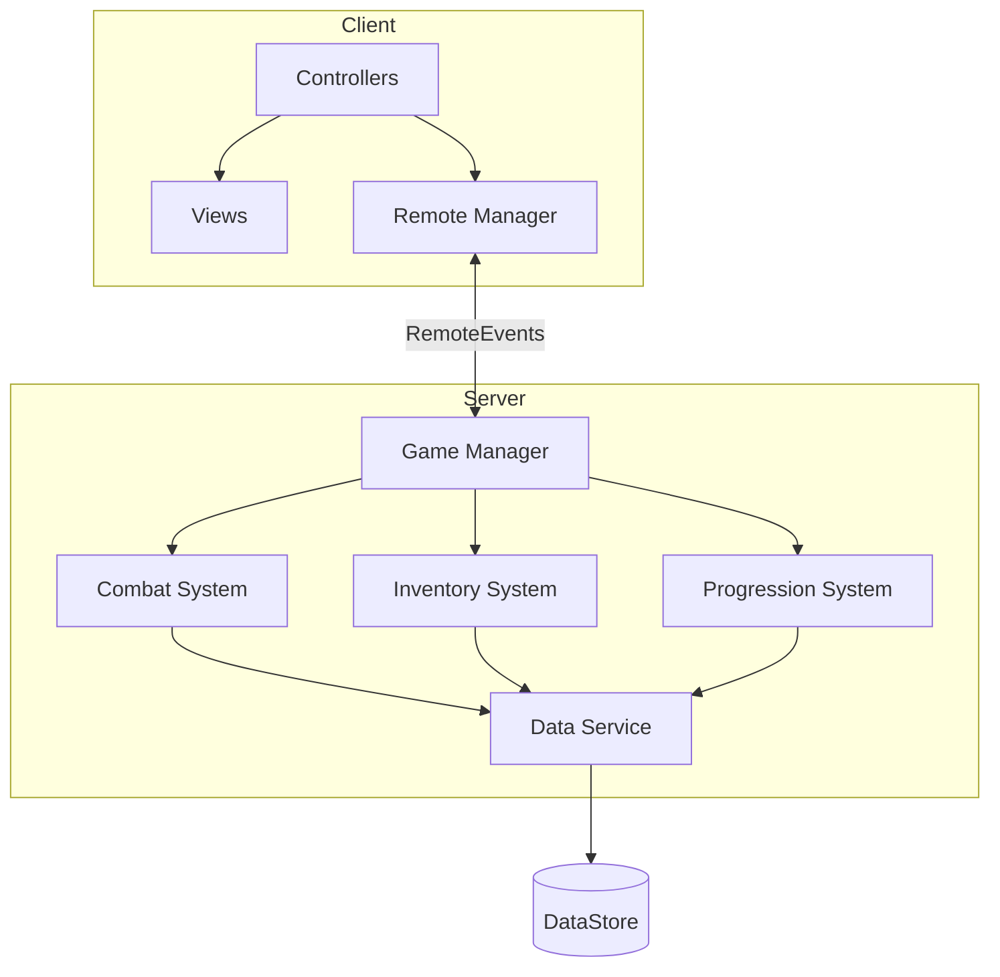
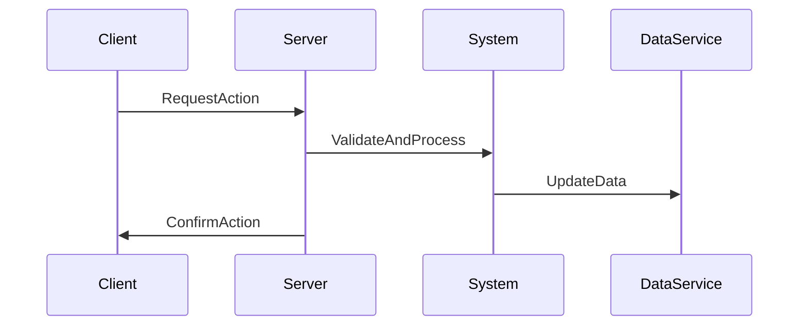

# Task: Create Technical Architecture

## Purpose

Designs comprehensive technical architecture for Roblox games following Roblox best practices, Server-Side Authority (SSA) patterns, and professional coding standards. Creates scalable, maintainable, and secure system designs that enable efficient development and long-term code health.

---

## Execution Modes

**Choose your execution mode:**

### 1. YOLO Mode - Fast, Autonomous (0-1 prompts)
- Autonomous decision making with logging
- Minimal user interaction
- **Best for:** Simple games, architecture updates

### 2. Interactive Mode - Balanced, Educational (5-10 prompts) **[DEFAULT]**
- Explicit decision checkpoints for architectural choices
- Educational explanations about patterns
- **Best for:** New architectures, complex systems

### 3. Pre-Flight Planning - Comprehensive Upfront Planning
- Complete technical requirements upfront
- All architectural decisions documented first
- **Best for:** Team projects, critical systems

**Parameter:** `mode` (optional, default: `interactive`)

---

## Task Definition (AIOS Task Format V1.0)

```yaml
task: createArchitecture()
responsavel: "@lua-scripter"
responsavel_type: Agent
atomic_layer: Technical

**Entrada:**
- campo: game_name
  tipo: string
  origem: User Input
  obrigatorio: true
  validacao: Valid game name
  exemplo: "Tower Defense Legends"

- campo: gdd_reference
  tipo: string
  origem: File Reference
  obrigatorio: true
  validacao: Path to GDD document
  exemplo: "docs/gdd/tower-defense-legends-gdd.md"

- campo: scale
  tipo: string
  origem: User Input
  obrigatorio: false
  validacao: One of [small, medium, large, massive]
  default: "medium"

- campo: max_players
  tipo: number
  origem: GDD / User Input
  obrigatorio: false
  validacao: 1-100
  default: 50

- campo: persistence_requirements
  tipo: array
  origem: GDD
  obrigatorio: false
  validacao: List of data types to persist
  exemplo: ["player_stats", "inventory", "progression"]

- campo: realtime_requirements
  tipo: array
  origem: GDD
  obrigatorio: false
  validacao: List of realtime features
  exemplo: ["combat", "trading", "chat"]

**Saida:**
- campo: architecture_document
  tipo: file
  destino: docs/architecture/{game-name}-architecture.md
  persistido: true

- campo: folder_structure
  tipo: file
  destino: docs/architecture/{game-name}-structure.md
  persistido: true

- campo: system_diagrams
  tipo: array
  destino: docs/architecture/diagrams/
  persistido: true

- campo: code_templates
  tipo: array
  destino: templates/roblox/{game-name}/
  persistido: true
```

---

## Pre-Conditions

**Purpose:** Validate prerequisites BEFORE task execution (blocking)

**Checklist:**

```yaml
pre-conditions:
  - [ ] GDD exists with systems defined
    tipo: pre-condition
    blocker: true
    validacao: |
      Verify GDD has core systems documented
    error_message: "Pre-condition failed: GDD with systems required"

  - [ ] Scale and player requirements understood
    tipo: pre-condition
    blocker: true
    validacao: |
      Check max players and scale are defined
    error_message: "Pre-condition failed: Scale requirements must be defined"

  - [ ] Persistence requirements identified
    tipo: pre-condition
    blocker: false
    validacao: |
      Check what data needs to be saved
    error_message: "Warning: No persistence requirements defined"
```

---

## Post-Conditions

**Purpose:** Validate execution success AFTER task completes

**Checklist:**

```yaml
post-conditions:
  - [ ] Architecture covers all GDD systems
    tipo: post-condition
    blocker: true
    validacao: |
      Verify each GDD system has technical design
    error_message: "Post-condition failed: Not all systems have architecture"

  - [ ] SSA pattern properly applied
    tipo: post-condition
    blocker: true
    validacao: |
      Verify server-side authority for all critical systems
    error_message: "Post-condition failed: SSA not properly applied"

  - [ ] DataStore schema designed
    tipo: post-condition
    blocker: true
    validacao: |
      Verify data persistence architecture
    error_message: "Post-condition failed: DataStore design missing"
```

---

## Acceptance Criteria

**Purpose:** Definitive pass/fail criteria for task completion

**Checklist:**

```yaml
acceptance-criteria:
  - [ ] Architecture is scalable to target player count
    tipo: acceptance-criterion
    blocker: true
    validacao: |
      Assert architecture handles max_players * 1.5 headroom
    error_message: "Acceptance criterion not met: Scalability concerns"

  - [ ] Security patterns implemented for all sensitive systems
    tipo: acceptance-criterion
    blocker: true
    validacao: |
      Verify anti-cheat and validation patterns
    error_message: "Acceptance criterion not met: Security gaps identified"

  - [ ] Performance targets achievable
    tipo: acceptance-criterion
    blocker: true
    validacao: |
      Check architecture meets 60fps target
    error_message: "Acceptance criterion not met: Performance concerns"
```

---

## Tools

**External/shared resources used by this task:**

- **Tool:** roblox-api-reference
  - **Purpose:** Reference Roblox services and APIs
  - **Source:** Roblox Developer Hub

- **Tool:** ssa-framework
  - **Purpose:** Server-Side Authority pattern templates
  - **Source:** squads/roblox-game-studio/templates/ssa/

- **Tool:** datastore-designer
  - **Purpose:** DataStore schema design and validation
  - **Source:** squads/roblox-game-studio/scripts/datastore-designer.js

---

## Scripts

**Agent-specific code for this task:**

- **Script:** architecture-generator.js
  - **Purpose:** Generate architecture documentation
  - **Language:** JavaScript
  - **Location:** squads/roblox-game-studio/scripts/architecture-generator.js

- **Script:** system-mapper.js
  - **Purpose:** Map GDD systems to technical components
  - **Language:** JavaScript
  - **Location:** squads/roblox-game-studio/scripts/system-mapper.js

---

## Error Handling

**Strategy:** iterative-refinement

**Common Errors:**

1. **Error:** System Complexity Exceeds Roblox Limits
   - **Cause:** Design requires more resources than Roblox allows
   - **Resolution:** Simplify or distribute across servers
   - **Recovery:** Redesign with MessagingService for cross-server

2. **Error:** DataStore Limits Exceeded
   - **Cause:** Data model too large for single key
   - **Resolution:** Shard data across multiple keys
   - **Recovery:** Implement pagination/chunking strategy

3. **Error:** Network Bandwidth Concerns
   - **Cause:** Too much RemoteEvent traffic
   - **Resolution:** Batch updates, reduce frequency
   - **Recovery:** Implement delta compression

4. **Error:** Client-Server Trust Violation
   - **Cause:** Critical logic placed on client
   - **Resolution:** Move to server, add validation
   - **Recovery:** Refactor to SSA pattern

---

## Performance

**Expected Metrics:**

```yaml
duration_expected: 25-60 min (estimated)
cost_estimated: $0.02-0.05
token_usage: ~15,000-40,000 tokens
```

**Optimization Notes:**
- Use cached Roblox API documentation
- Template common architecture patterns
- Parallelize system design

---

## Metadata

```yaml
story: N/A
version: 1.0.0
dependencies:
  - gdd-document
tags:
  - architecture
  - technical
  - roblox
  - lua
updated_at: 2025-01-28
```

---

## Process

### Phase 1: Requirements Analysis (5-10 min)

**Purpose:** Extract technical requirements from GDD

**Steps:**

1. **Parse GDD Systems**
   - Extract all defined systems from GDD
   - Identify system dependencies
   - Categorize by: Core, Supporting, Meta
   - Note real-time requirements
   - Output: System inventory

2. **Identify Data Requirements**
   - List all persistent data types
   - Categorize by: Player, World, Session
   - Estimate data sizes
   - Note update frequencies
   - Output: Data requirements matrix

3. **Analyze Network Requirements**
   - Identify real-time sync needs
   - List required RemoteEvents/Functions
   - Estimate bandwidth per player
   - Note latency-sensitive operations
   - Output: Network requirements

4. **Define Scale Parameters**
   - Set max concurrent players
   - Define server instance limits
   - Estimate memory budget
   - Set performance targets
   - Output: Scale parameters

5. **Security Requirements**
   - Identify exploitable systems
   - List validation requirements
   - Note anti-cheat needs
   - Define trust boundaries
   - Output: Security requirements

---

### Phase 2: Architectural Patterns (10-15 min)

**Purpose:** Design core architectural patterns

**Steps:**

1. **Design Folder Structure**
   - Define ServerScriptService structure
   - Define ReplicatedStorage structure
   - Define StarterPlayerScripts structure
   - Plan module organization
   - Create naming conventions
   - Output: Folder structure document

   ```
   game/
   ├── ServerScriptService/
   │   ├── Core/
   │   │   ├── init.server.lua      # Main entry point
   │   │   ├── PlayerManager.lua    # Player lifecycle
   │   │   └── GameManager.lua      # Game state
   │   ├── Systems/
   │   │   ├── CombatSystem/
   │   │   ├── InventorySystem/
   │   │   └── ProgressionSystem/
   │   └── Services/
   │       ├── DataService.lua      # DataStore wrapper
   │       ├── RemoteService.lua    # Remote handling
   │       └── SecurityService.lua  # Validation
   ├── ReplicatedStorage/
   │   ├── Modules/
   │   │   ├── Types/               # Shared types
   │   │   ├── Config/              # Shared config
   │   │   └── Utils/               # Shared utilities
   │   └── Remotes/                 # Remote definitions
   └── StarterPlayerScripts/
       ├── Controllers/             # Input & UI controllers
       └── Views/                   # UI components
   ```

2. **Design Server-Side Authority (SSA) Pattern**
   - Define authority boundaries
   - Create validation patterns
   - Design state replication
   - Plan prediction/reconciliation
   - Output: SSA pattern guide

3. **Design Communication Layer**
   - Define Remote naming conventions
   - Create Remote registry pattern
   - Design rate limiting
   - Plan payload validation
   - Output: Communication protocol

4. **Design State Management**
   - Choose state pattern (ECS, OOP, Hybrid)
   - Design state containers
   - Plan state synchronization
   - Create change detection
   - Output: State management pattern

5. **Design Dependency Injection**
   - Create service locator pattern
   - Design lazy loading
   - Plan circular dependency prevention
   - Create initialization order
   - Output: DI pattern guide

6. **Design Error Handling**
   - Create error types
   - Design error propagation
   - Plan error logging
   - Create recovery strategies
   - Output: Error handling guide

---

### Phase 3: System Design (15-20 min)

**Purpose:** Design individual system architectures

**Steps:**

1. **Core Game System**
   - Design game state machine
   - Create round/session lifecycle
   - Plan player spawning/management
   - Design win/lose conditions
   - Output: Core system specification

2. **Combat/Interaction System** (if applicable)
   - Design damage calculation flow
   - Create hit detection (server-side)
   - Plan ability/skill system
   - Design status effects
   - Output: Combat system specification

3. **Inventory/Collection System** (if applicable)
   - Design inventory data model
   - Create item definitions
   - Plan item transactions
   - Design collection tracking
   - Output: Inventory system specification

4. **Progression System**
   - Design XP/level calculation
   - Create unlock system
   - Plan prestige mechanics
   - Design milestone tracking
   - Output: Progression system specification

5. **Economy System**
   - Design currency operations
   - Create transaction logging
   - Plan economy validation
   - Design sink/source balance
   - Output: Economy system specification

6. **Social Systems**
   - Design friend integration
   - Create party/group system
   - Plan trading (if applicable)
   - Design chat integration
   - Output: Social systems specification

7. **System Integration Map**
   - Create dependency diagram
   - Define interfaces between systems
   - Plan event bus/signals
   - Document data flows
   - Output: Integration diagram

---

### Phase 4: Data Architecture (5-10 min)

**Purpose:** Design data persistence layer

**Steps:**

1. **Design DataStore Schema**
   - Define player data structure
   - Plan data versioning
   - Design migration strategy
   - Create backup patterns
   - Output: DataStore schema

   ```lua
   -- Player Data Schema v1
   PlayerData = {
       version = 1,
       stats = {
           level = 1,
           xp = 0,
           coins = 0,
           gems = 0,
       },
       inventory = {
           items = {},
           equipped = {},
       },
       progression = {
           unlocks = {},
           achievements = {},
       },
       settings = {
           music = true,
           sfx = true,
       },
       meta = {
           firstJoin = 0,
           lastJoin = 0,
           totalPlayTime = 0,
       },
   }
   ```

2. **Design Data Access Layer**
   - Create DataService wrapper
   - Implement retry logic
   - Design caching strategy
   - Plan data validation
   - Output: Data access pattern

3. **Design Session Data**
   - Plan in-memory data structures
   - Design session state
   - Create cleanup patterns
   - Plan cross-session persistence
   - Output: Session data specification

4. **Plan Data Migration**
   - Create version upgrade path
   - Design backward compatibility
   - Plan rollback strategy
   - Create migration scripts
   - Output: Migration guide

5. **Design Analytics Data**
   - Plan event tracking
   - Design custom analytics
   - Create reporting structures
   - Output: Analytics schema

---

### Phase 5: Security Architecture (5-10 min)

**Purpose:** Design security and anti-cheat measures

**Steps:**

1. **Define Trust Boundaries**
   - Map client vs server trust
   - Identify attack vectors
   - Document trusted operations
   - Output: Trust boundary diagram

2. **Design Input Validation**
   - Create validation middleware
   - Define validation rules
   - Plan sanitization
   - Output: Validation patterns

   ```lua
   -- Validation Pattern Example
   local function validateDamageRequest(player, targetId, damage)
       -- 1. Verify player exists and is alive
       if not PlayerManager:IsAlive(player) then
           return false, "Player not alive"
       end

       -- 2. Verify target exists
       local target = EntityManager:GetEntity(targetId)
       if not target then
           return false, "Invalid target"
       end

       -- 3. Verify range
       local distance = (player.Character.HumanoidRootPart.Position - target.Position).Magnitude
       if distance > MAX_ATTACK_RANGE then
           return false, "Target out of range"
       end

       -- 4. Verify cooldown
       if not CooldownManager:CanAttack(player) then
           return false, "Attack on cooldown"
       end

       -- 5. Recalculate damage server-side
       local serverDamage = DamageCalculator:Calculate(player, target)

       return true, serverDamage
   end
   ```

3. **Design Anti-Exploit Measures**
   - Create speed check system
   - Design teleport detection
   - Plan value manipulation detection
   - Create exploit logging
   - Output: Anti-exploit specification

4. **Design Rate Limiting**
   - Define rate limits per action
   - Create throttling implementation
   - Plan burst handling
   - Output: Rate limiting configuration

5. **Design Audit Logging**
   - Plan transaction logging
   - Create audit trail structure
   - Design log analysis
   - Output: Audit logging specification

---

### Phase 6: Performance Architecture (5-10 min)

**Purpose:** Design for optimal performance

**Steps:**

1. **Memory Budget Allocation**
   - Set part count limits
   - Plan texture budgets
   - Design asset streaming
   - Create LOD strategy
   - Output: Memory budget

2. **Network Optimization**
   - Design delta updates
   - Plan event batching
   - Create payload compression
   - Optimize replication
   - Output: Network optimization guide

3. **Script Optimization**
   - Design object pooling
   - Plan coroutine usage
   - Create caching strategies
   - Optimize hot paths
   - Output: Script optimization guide

4. **Streaming Configuration**
   - Plan StreamingEnabled settings
   - Design loading zones
   - Create asset preloading
   - Output: Streaming configuration

5. **Benchmark Targets**
   - Define FPS targets
   - Set memory limits
   - Create network budget
   - Plan monitoring
   - Output: Performance targets

---

### Phase 7: Documentation & Templates (5-10 min)

**Purpose:** Create final deliverables

**Steps:**

1. **Compile Architecture Document**
   - Merge all sections
   - Add overview diagrams
   - Create implementation notes
   - Output: Complete architecture document

2. **Generate System Diagrams**
   - Create Mermaid diagrams
   - Generate flowcharts
   - Create data flow diagrams
   - Output: Diagram files

3. **Create Code Templates**
   - Generate module templates
   - Create system boilerplate
   - Produce remote patterns
   - Output: Template files

4. **Create Implementation Guide**
   - Development priorities
   - Setup instructions
   - Testing requirements
   - Output: Implementation guide

5. **Update Memory Layer**
   - Store architecture decisions
   - Cache patterns
   - Link documents
   - Output: Memory updates

---

## Output Structure

### Architecture Document

```markdown
# Technical Architecture: {Game Name}

**Version:** 1.0
**Last Updated:** {Date}
**Author:** @lua-scripter
**Scale:** {small/medium/large/massive}
**Max Players:** {N}

---

## Overview

### Architecture Diagram



### Design Principles
1. **Server-Side Authority:** All game state changes validated server-side
2. **Modularity:** Systems are independent and communicate via events
3. **Performance First:** 60fps target, memory-conscious design
4. **Security by Default:** No trusted client data

---

## Folder Structure

```
{Complete folder structure}
```

---

## Systems Architecture

### System 1: {System Name}
**Responsibility:** {Description}
**Location:** ServerScriptService/Systems/{System}
**Dependencies:** {List}

#### API
```lua
System:Method(params) -> returns
```

#### Events
- `System.EventName` - Fired when {condition}

#### Data Flow


[Repeat for each system]

---

## Data Architecture

### DataStore Schema
```lua
{Schema definition}
```

### Data Access Patterns
{Patterns description}

---

## Security Architecture

### Trust Boundaries
{Diagram and description}

### Validation Patterns
{Code examples}

### Anti-Exploit Measures
{Description}

---

## Performance Targets

| Metric | Target | Warning | Critical |
|--------|--------|---------|----------|
| FPS | 60 | <45 | <30 |
| Memory | <500MB | >600MB | >800MB |
| Network | <50KB/s | >75KB/s | >100KB/s |

---

## Implementation Priorities

1. **Phase 1 (Core):** {Systems}
2. **Phase 2 (Features):** {Systems}
3. **Phase 3 (Polish):** {Systems}

---

## Appendices

### A. Code Templates
{Links to templates}

### B. Pattern Reference
{Common patterns}

### C. Roblox Service Reference
{Used services}
```

---

## Usage Examples

### Example 1: Medium-Scale Game

```bash
@lua-scripter
*create-architecture "Tower Defense Legends" --gdd "docs/gdd/tdl-gdd.md" --scale medium --max-players 50
```

### Example 2: Large Multiplayer Game

```bash
@lua-scripter
*create-architecture "Battle Royale Arena" --gdd "docs/gdd/br-gdd.md" --scale large --max-players 100
```

### Example 3: Simple Single-Player

```bash
@lua-scripter
*create-architecture "Obby Adventure" --gdd "docs/gdd/obby-gdd.md" --scale small --max-players 10
```

---

## Integration Points

- **Input from:** Game Designer (GDD), Market Analyst (scale requirements)
- **Output to:** Lua Scripter (implementation), QA (testing), UI/UX (client integration)
- **Triggers:** GDD completion, scale change, system addition
- **Updates Memory:** Architecture patterns, security requirements, performance targets
