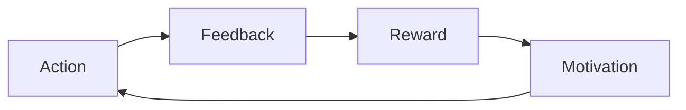
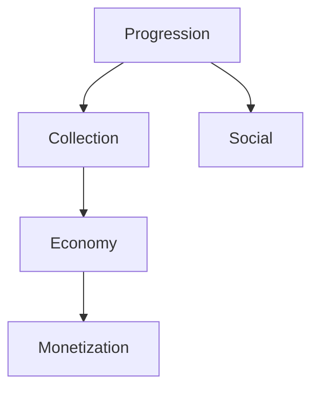
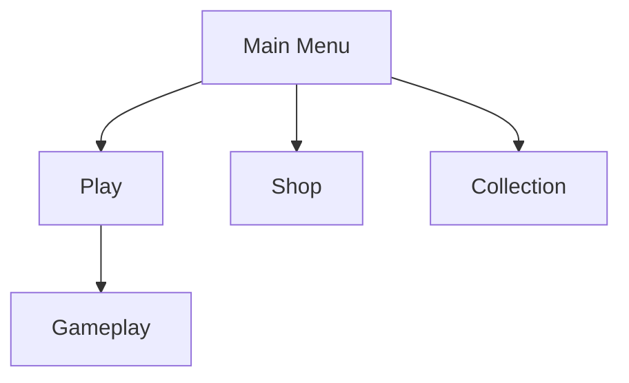

# Task: Create Game Design Document (GDD)

## Purpose

Creates a comprehensive, interactive Game Design Document for Roblox games following industry standards adapted for the platform. The GDD serves as the single source of truth for game vision, mechanics, systems, and implementation guidance, enabling team alignment and iterative development.

---

## Execution Modes

**Choose your execution mode:**

### 1. YOLO Mode - Fast, Autonomous (0-1 prompts)
- Autonomous decision making with logging
- Minimal user interaction
- **Best for:** GDD updates, simple casual games

### 2. Interactive Mode - Balanced, Educational (5-10 prompts) **[DEFAULT]**
- Explicit decision checkpoints for core design pillars
- Educational explanations about design choices
- **Best for:** New GDDs, complex games, learning

### 3. Pre-Flight Planning - Comprehensive Upfront Planning
- Complete design vision alignment upfront
- All stakeholder input gathered first
- **Best for:** Team projects, funded games, major releases

**Parameter:** `mode` (optional, default: `interactive`)

---

## Task Definition (AIOS Task Format V1.0)

```yaml
task: createGDD()
responsavel: "@game-designer"
responsavel_type: Agent
atomic_layer: Design

**Entrada:**
- campo: game_name
  tipo: string
  origem: User Input
  obrigatorio: true
  validacao: 3-50 characters, valid Roblox game name
  exemplo: "Tower Defense Legends"

- campo: genre
  tipo: string
  origem: User Input
  obrigatorio: true
  validacao: Valid Roblox genre
  exemplo: "Tower Defense"

- campo: concept
  tipo: string
  origem: User Input / Market Analysis
  obrigatorio: true
  validacao: 50-1000 character description
  exemplo: "Anime-inspired tower defense with collectible heroes and strategic depth"

- campo: target_audience
  tipo: object
  origem: User Input / Market Analysis
  obrigatorio: false
  validacao: Age range, demographics, player types
  default: { age: "8-16", region: "global", playerType: "casual-midcore" }

- campo: market_analysis
  tipo: string
  origem: File Reference
  obrigatorio: false
  validacao: Path to market analysis document
  exemplo: "docs/market-analysis/tower-defense-legends.md"

- campo: scope
  tipo: string
  origem: User Input
  obrigatorio: false
  validacao: One of [mvp, full, live-service]
  default: "mvp"

**Saida:**
- campo: gdd_document
  tipo: file
  destino: docs/gdd/{game-name}-gdd.md
  persistido: true

- campo: design_pillars
  tipo: array
  destino: Memory
  persistido: true

- campo: feature_backlog
  tipo: array
  destino: docs/backlog/{game-name}-features.md
  persistido: true

- campo: system_diagrams
  tipo: array
  destino: docs/gdd/diagrams/
  persistido: true
```

---

## Pre-Conditions

**Purpose:** Validate prerequisites BEFORE task execution (blocking)

**Checklist:**

```yaml
pre-conditions:
  - [ ] Game concept is validated (ideally with market analysis)
    tipo: pre-condition
    blocker: false
    validacao: |
      Check if market analysis exists; proceed with caution if not
    error_message: "Warning: No market analysis found. GDD may need revision after market validation"

  - [ ] Core genre and target audience defined
    tipo: pre-condition
    blocker: true
    validacao: |
      Verify genre is specified and valid for Roblox
    error_message: "Pre-condition failed: Genre must be defined"

  - [ ] GDD does not already exist (or overwrite confirmed)
    tipo: pre-condition
    blocker: true
    validacao: |
      Check if GDD file exists; prompt for overwrite if so
    error_message: "Pre-condition failed: GDD already exists. Use --force to overwrite"
```

---

## Post-Conditions

**Purpose:** Validate execution success AFTER task completes

**Checklist:**

```yaml
post-conditions:
  - [ ] GDD contains all required sections
    tipo: post-condition
    blocker: true
    validacao: |
      Verify: Vision, Pillars, Core Loop, Mechanics, Systems, Economy, UI/UX, Technical
    error_message: "Post-condition failed: GDD missing required sections"

  - [ ] Design pillars are clearly defined (3-5 pillars)
    tipo: post-condition
    blocker: true
    validacao: |
      Check design pillars count and clarity
    error_message: "Post-condition failed: Design pillars not properly defined"

  - [ ] Core loop is documented with diagram
    tipo: post-condition
    blocker: true
    validacao: |
      Verify core loop description and visual representation
    error_message: "Post-condition failed: Core loop documentation incomplete"
```

---

## Acceptance Criteria

**Purpose:** Definitive pass/fail criteria for task completion

**Checklist:**

```yaml
acceptance-criteria:
  - [ ] GDD is comprehensive enough for development to begin
    tipo: acceptance-criterion
    blocker: true
    validacao: |
      Assert GDD provides clear direction for all team members
    error_message: "Acceptance criterion not met: GDD lacks implementation detail"

  - [ ] All game systems have at least basic specification
    tipo: acceptance-criterion
    blocker: true
    validacao: |
      Check each major system has description, inputs, outputs, rules
    error_message: "Acceptance criterion not met: Systems not fully specified"

  - [ ] Economy design is balanced and ethical
    tipo: acceptance-criterion
    blocker: true
    validacao: |
      Verify economy has been reviewed for player-friendliness
    error_message: "Acceptance criterion not met: Economy design needs review"
```

---

## Tools

**External/shared resources used by this task:**

- **Tool:** template-system
  - **Purpose:** Load and populate GDD template
  - **Source:** squads/roblox-game-studio/templates/gdd-template.md

- **Tool:** diagram-tool (Mermaid)
  - **Purpose:** Generate system diagrams and flowcharts
  - **Source:** Mermaid markdown integration

- **Tool:** feature-tracker
  - **Purpose:** Generate feature backlog from GDD
  - **Source:** squads/roblox-game-studio/scripts/feature-extractor.js

---

## Scripts

**Agent-specific code for this task:**

- **Script:** gdd-generator.js
  - **Purpose:** Orchestrate GDD creation workflow
  - **Language:** JavaScript
  - **Location:** squads/roblox-game-studio/scripts/gdd-generator.js

- **Script:** balance-calculator.js
  - **Purpose:** Initial economy balance calculations
  - **Language:** JavaScript
  - **Location:** squads/roblox-game-studio/scripts/balance-calculator.js

---

## Error Handling

**Strategy:** checkpoint-recovery

**Common Errors:**

1. **Error:** Incomplete Vision Statement
   - **Cause:** User unable to articulate clear vision
   - **Resolution:** Use guided elicitation with examples
   - **Recovery:** Provide vision templates and competitor examples

2. **Error:** Conflicting Design Pillars
   - **Cause:** Pillars that contradict each other
   - **Resolution:** Facilitate pillar prioritization discussion
   - **Recovery:** Create hierarchy or remove conflicting pillar

3. **Error:** Scope Creep
   - **Cause:** Too many features for MVP scope
   - **Resolution:** Apply MoSCoW prioritization
   - **Recovery:** Split into MVP and future phases

4. **Error:** Unbalanced Economy
   - **Cause:** Economy values don't support sustainable gameplay
   - **Resolution:** Run balance simulation
   - **Recovery:** Iterate with @monetization-strategist

---

## Performance

**Expected Metrics:**

```yaml
duration_expected: 30-90 min (estimated)
cost_estimated: $0.02-0.08
token_usage: ~15,000-50,000 tokens
```

**Optimization Notes:**
- Use progressive disclosure to gather information
- Cache common genre templates
- Parallelize system documentation
- Allow incremental saves

---

## Metadata

```yaml
story: N/A
version: 1.0.0
dependencies:
  - market-analysis (optional)
  - game-concept
tags:
  - game-design
  - documentation
  - roblox
updated_at: 2025-01-28
```

---

## Process

### Phase 1: Vision & Foundation (10-15 min)

**Purpose:** Establish core game identity and direction

**Steps:**

1. **Load Context**
   - Check for existing market analysis
   - Load genre-specific templates
   - Review competitor GDDs (if available)
   - Initialize GDD document structure
   - Output: Pre-populated GDD skeleton

2. **Define Vision Statement**
   - Elicit 2-3 sentence game vision
   - Format: "In {Game}, players {core experience} through {core mechanic} to {ultimate goal}"
   - Validate vision is achievable on Roblox
   - Ensure vision differentiates from competitors
   - Output: Vision statement block

3. **Establish Design Pillars (3-5)**
   - Elicit core values that guide all design decisions
   - Examples: "Strategic Depth", "Collectible Excitement", "Social Competition"
   - Rank pillars by priority
   - Create pillar descriptions with do's and don'ts
   - Output: Design pillars section

4. **Define Target Experience**
   - Describe ideal first-time user experience (FTUE)
   - Define "moment-to-moment" gameplay feeling
   - Articulate "sticky" moments that drive retention
   - Identify core emotional hooks
   - Output: Target experience narrative

5. **Set Scope Boundaries**
   - Define MVP features (absolute minimum)
   - List v1.0 features (launch target)
   - Catalog future features (roadmap)
   - Create explicit "not doing" list
   - Output: Scope definition matrix

---

### Phase 2: Core Loop & Mechanics (15-20 min)

**Purpose:** Design the fundamental gameplay systems

**Steps:**

1. **Define Core Loop**
   - Identify primary player action cycle
   - Map: Action -> Feedback -> Reward -> Motivation -> Action
   - Ensure loop completes in 30-120 seconds
   - Diagram the core loop
   - Output: Core loop documentation + Mermaid diagram

2. **Design Primary Mechanics**
   - List 3-7 core mechanics
   - For each mechanic:
     - Name and description
     - Player input required
     - System response/feedback
     - Connection to core loop
     - Roblox implementation considerations
   - Output: Primary mechanics specifications

3. **Map Secondary Mechanics**
   - Identify supporting mechanics
   - Define unlock conditions
   - Establish progression gates
   - Connect to primary mechanics
   - Output: Mechanics dependency map

4. **Design Moment-to-Moment Gameplay**
   - Describe typical 5-minute play session
   - Identify decision points
   - Map tension and release cycles
   - Define "juice" elements (VFX, SFX, haptics)
   - Output: Gameplay session narrative

5. **Create Controls & Input Scheme**
   - Design for primary platform (mobile-first recommended)
   - Define touch controls
   - Define keyboard/mouse controls
   - Define gamepad controls
   - Ensure accessibility considerations
   - Output: Control scheme documentation

6. **Balance Initial Parameters**
   - Set initial numeric values for mechanics
   - Document tuning variables
   - Create balance spreadsheet skeleton
   - Flag values needing playtesting
   - Output: Initial balance parameters

---

### Phase 3: Systems Design (15-25 min)

**Purpose:** Specify major game systems in detail

**Steps:**

1. **Progression System**
   - Define player progression paths
   - Design level/rank system (if applicable)
   - Map unlock tree
   - Balance progression curve (time to milestones)
   - Create prestige/reset mechanics (if applicable)
   - Output: Progression system specification

2. **Collection/Inventory System**
   - Define collectible types (characters, items, etc.)
   - Design rarity tiers (Common/Rare/Epic/Legendary/Mythic)
   - Create collection mechanics (how to obtain)
   - Design storage/organization
   - Plan collection completion rewards
   - Output: Collection system specification

3. **Social Systems**
   - Design multiplayer interactions
   - Create trading system (if applicable)
   - Design guild/clan system (if applicable)
   - Plan leaderboards and rankings
   - Design social features (emotes, chat, etc.)
   - Output: Social systems specification

4. **Meta Systems**
   - Design daily/weekly challenges
   - Create seasonal content framework
   - Plan limited-time events
   - Design achievement system
   - Create long-term engagement hooks
   - Output: Meta systems specification

5. **Tutorial & Onboarding**
   - Design FTUE flow (first 5 minutes)
   - Create tutorial progression
   - Plan hint/help systems
   - Design skip options for experienced players
   - Output: Onboarding specification

6. **System Integration Map**
   - Create system dependency diagram
   - Identify data flows between systems
   - Map event triggers
   - Document API contracts between systems
   - Output: System integration diagram

---

### Phase 4: Economy & Monetization (10-15 min)

**Purpose:** Design sustainable and ethical game economy

**Steps:**

1. **Define Currency System**
   - Primary currency (earned through play)
   - Premium currency (purchased)
   - Secondary currencies (event-specific, etc.)
   - Conversion rates and caps
   - Output: Currency specification

2. **Design Earning Loops**
   - Define how players earn primary currency
   - Balance earning rate vs spending sinks
   - Create earning milestones
   - Prevent excessive inflation
   - Output: Earning economy model

3. **Design Spending Sinks**
   - Catalog all currency sinks
   - Balance sink depth vs earning rate
   - Create compelling spend reasons
   - Avoid pay-to-win mechanics
   - Output: Spending economy model

4. **Plan Monetization Touch Points**
   - Identify natural purchase moments
   - Design Game Passes
   - Design Dev Products
   - Create value propositions
   - Ensure ethical implementation
   - Output: Monetization integration plan

5. **Balance Economy Model**
   - Calculate time-to-earn key items
   - Model F2P vs paying player progression
   - Ensure fair competitive balance
   - Run economy simulation
   - Output: Economy balance report

6. **Ethical Review**
   - Check for manipulative patterns
   - Verify no pay-to-win
   - Ensure child-safety compliance
   - Review against Roblox ToS
   - Output: Ethical compliance checklist

---

### Phase 5: UI/UX Framework (5-10 min)

**Purpose:** Define user interface and experience guidelines

**Steps:**

1. **Define UI Principles**
   - Establish UI design pillars
   - Define mobile-first approach
   - Set readability standards
   - Create accessibility guidelines
   - Output: UI principles document

2. **Map Screen Flow**
   - Create screen inventory
   - Design navigation hierarchy
   - Map user flows for core tasks
   - Identify modal vs full-screen patterns
   - Output: Screen flow diagram

3. **HUD Design**
   - Define always-visible elements
   - Design contextual UI
   - Plan notification systems
   - Create feedback indicators
   - Output: HUD specification

4. **Menu Structure**
   - Design main menu
   - Plan settings organization
   - Create inventory/collection UI
   - Design shop interface
   - Output: Menu wireframe descriptions

---

### Phase 6: Technical Requirements (5-10 min)

**Purpose:** Document technical considerations for implementation

**Steps:**

1. **Platform Requirements**
   - Define minimum device specs
   - Plan for mobile optimization
   - Consider console requirements
   - Set performance targets
   - Output: Platform requirements

2. **Data Architecture**
   - Define DataStore schema
   - Plan data migration strategy
   - Design offline handling
   - Create backup/recovery plan
   - Output: Data architecture document

3. **Network Architecture**
   - Define client-server split
   - Plan RemoteEvent structure
   - Design anti-cheat measures
   - Optimize bandwidth usage
   - Output: Network architecture plan

4. **Performance Guidelines**
   - Set part count limits
   - Define LOD strategies
   - Plan streaming enabled usage
   - Create optimization checklist
   - Output: Performance guidelines

---

### Phase 7: Compile & Finalize (5-10 min)

**Purpose:** Create final GDD document and supporting files

**Steps:**

1. **Compile GDD Document**
   - Merge all sections
   - Add table of contents
   - Create internal links
   - Format for readability
   - Output: Complete GDD markdown file

2. **Generate Feature Backlog**
   - Extract features from GDD
   - Prioritize with MoSCoW
   - Create story templates
   - Estimate complexity
   - Output: Feature backlog file

3. **Create System Diagrams**
   - Generate Mermaid diagrams
   - Create visual reference sheets
   - Export for team reference
   - Output: Diagram files

4. **Update Memory Layer**
   - Store design pillars
   - Cache key parameters
   - Link to related documents
   - Output: Memory updates

5. **Create Summary Card**
   - One-page GDD summary
   - Key metrics and targets
   - Quick reference for team
   - Output: GDD summary card

---

## Output Structure

### GDD Document Template

```markdown
# Game Design Document: {Game Name}

**Version:** 1.0
**Last Updated:** {Date}
**Author:** @game-designer
**Status:** Draft / Review / Approved

---

## Table of Contents
1. Vision & Pillars
2. Core Loop & Mechanics
3. Systems Design
4. Economy & Monetization
5. UI/UX Framework
6. Technical Requirements
7. Appendices

---

## 1. Vision & Pillars

### 1.1 Vision Statement
{2-3 sentence game vision}

### 1.2 Design Pillars

| Pillar | Priority | Description | Do | Don't |
|--------|----------|-------------|-------|-------|
| {Pillar 1} | 1 | {Description} | {Examples} | {Anti-examples} |
| {Pillar 2} | 2 | {Description} | {Examples} | {Anti-examples} |
| {Pillar 3} | 3 | {Description} | {Examples} | {Anti-examples} |

### 1.3 Target Experience
{Description of ideal player experience}

### 1.4 Scope Definition

| Phase | Features | Timeline |
|-------|----------|----------|
| MVP | {List} | {Weeks} |
| v1.0 | {List} | {Weeks} |
| Future | {List} | TBD |

**Not Doing:**
- {Explicit exclusion 1}
- {Explicit exclusion 2}

---

## 2. Core Loop & Mechanics

### 2.1 Core Loop



{Core loop description}

### 2.2 Primary Mechanics

#### Mechanic 1: {Name}
- **Description:** {What it does}
- **Input:** {Player action}
- **Output:** {System response}
- **Roblox Implementation:** {Technical notes}

[Repeat for each mechanic]

### 2.3 Controls

| Action | Mobile | Keyboard | Gamepad |
|--------|--------|----------|---------|
| {Action} | {Touch} | {Key} | {Button} |

---

## 3. Systems Design

### 3.1 Progression System
{Detailed specification}

### 3.2 Collection System
{Detailed specification}

### 3.3 Social Systems
{Detailed specification}

### 3.4 Meta Systems
{Detailed specification}

### 3.5 System Integration



---

## 4. Economy & Monetization

### 4.1 Currency System

| Currency | Type | Earn Rate | Primary Use |
|----------|------|-----------|-------------|
| {Currency} | Soft/Hard | {Rate} | {Use} |

### 4.2 Economy Balance

| Item | Cost | Time to Earn | Pay Option |
|------|------|--------------|------------|
| {Item} | {Amount} | {Time} | {Price} |

### 4.3 Monetization Strategy
{Detailed strategy from @monetization-strategist}

---

## 5. UI/UX Framework

### 5.1 Screen Flow



### 5.2 HUD Elements
{HUD specification}

---

## 6. Technical Requirements

### 6.1 Performance Targets
- Target FPS: 60 (mobile), 60 (PC)
- Max part count: {X}
- Memory budget: {X} MB

### 6.2 DataStore Schema
{Schema definition}

---

## Appendices

### A. Balance Spreadsheet
[Link to spreadsheet]

### B. Feature Backlog
[Link to backlog]

### C. Reference Games
{List of reference games and what to learn from each}
```

---

## Usage Examples

### Example 1: Create MVP GDD

```bash
@game-designer
*create-gdd "Tower Defense Legends" --genre "Tower Defense" --concept "Anime tower defense with collectible heroes" --scope mvp
```

### Example 2: Full GDD with Market Analysis

```bash
@game-designer
*create-gdd "Pet Paradise" --genre "Simulator" --market-analysis "docs/market-analysis/pet-paradise.md" --scope full
```

### Example 3: Interactive Session for Complex Game

```bash
@game-designer
*create-gdd "Battle Royale Arena" --genre "FPS" --mode interactive
```

---

## Integration Points

- **Input from:** Market Analyst (market analysis), Product Owner (requirements)
- **Output to:** Lua Scripter (systems), UI/UX Designer (interface), Monetization Strategist (economy)
- **Triggers:** New game start, major pivot, version milestone
- **Updates Memory:** Design pillars, core mechanics, system specifications
