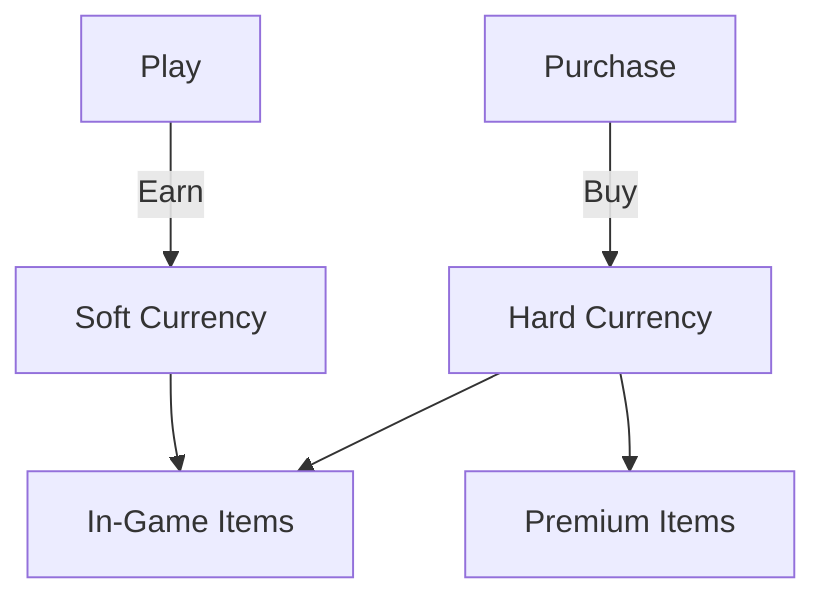

# Task: Create Monetization Strategy

## Purpose

Develops a comprehensive, ethical monetization strategy for Roblox games that maximizes sustainable revenue while prioritizing player experience and fairness. Balances business goals with player-friendly practices, ensuring compliance with Roblox Terms of Service and child-safety regulations.

---

## Execution Modes

**Choose your execution mode:**

### 1. YOLO Mode - Fast, Autonomous (0-1 prompts)
- Autonomous decision making with logging
- Minimal user interaction
- **Best for:** Simple games, pricing updates

### 2. Interactive Mode - Balanced, Educational (5-10 prompts) **[DEFAULT]**
- Explicit decision checkpoints for pricing tiers
- Educational explanations about monetization ethics
- **Best for:** New strategies, complex games

### 3. Pre-Flight Planning - Comprehensive Upfront Planning
- Complete business model definition upfront
- Stakeholder alignment on ethics boundaries
- **Best for:** Funded projects, publisher requirements

**Parameter:** `mode` (optional, default: `interactive`)

---

## Task Definition (AIOS Task Format V1.0)

```yaml
task: createMonetizationStrategy()
responsavel: "@monetization-strategist"
responsavel_type: Agent
atomic_layer: Business

**Entrada:**
- campo: game_name
  tipo: string
  origem: User Input
  obrigatorio: true
  validacao: Valid game name
  exemplo: "Tower Defense Legends"

- campo: gdd_reference
  tipo: string
  origem: File Reference
  obrigatorio: true
  validacao: Path to GDD document
  exemplo: "docs/gdd/tower-defense-legends-gdd.md"

- campo: target_revenue
  tipo: object
  origem: User Input
  obrigatorio: false
  validacao: Revenue targets by timeframe
  default: { monthly: "1000-5000", currency: "USD" }

- campo: player_base_estimate
  tipo: object
  origem: Market Analysis
  obrigatorio: false
  validacao: DAU/MAU estimates
  default: { dau: 1000, mau: 10000 }

- campo: ethics_priority
  tipo: string
  origem: User Input
  obrigatorio: false
  validacao: One of [strict, balanced, aggressive]
  default: "balanced"

- campo: competitor_pricing
  tipo: array
  origem: Market Analysis
  obrigatorio: false
  validacao: Array of competitor pricing data
  exemplo: [{ game: "Game X", gamepass: 499, products: [99, 199] }]

**Saida:**
- campo: monetization_document
  tipo: file
  destino: docs/monetization/{game-name}-strategy.md
  persistido: true

- campo: pricing_sheet
  tipo: file
  destino: docs/monetization/{game-name}-pricing.md
  persistido: true

- campo: ethics_report
  tipo: file
  destino: docs/monetization/{game-name}-ethics-review.md
  persistido: true

- campo: implementation_guide
  tipo: file
  destino: docs/monetization/{game-name}-implementation.md
  persistido: true
```

---

## Pre-Conditions

**Purpose:** Validate prerequisites BEFORE task execution (blocking)

**Checklist:**

```yaml
pre-conditions:
  - [ ] GDD exists with economy system defined
    tipo: pre-condition
    blocker: true
    validacao: |
      Verify GDD has currency system and progression defined
    error_message: "Pre-condition failed: GDD required with economy basics"

  - [ ] Target audience demographics understood
    tipo: pre-condition
    blocker: true
    validacao: |
      Check target audience age range is defined (affects pricing strategy)
    error_message: "Pre-condition failed: Target audience must be defined"

  - [ ] Core gameplay loop is designed
    tipo: pre-condition
    blocker: true
    validacao: |
      Verify core loop exists to identify monetization integration points
    error_message: "Pre-condition failed: Core loop must be designed first"
```

---

## Post-Conditions

**Purpose:** Validate execution success AFTER task completes

**Checklist:**

```yaml
post-conditions:
  - [ ] Monetization strategy covers all revenue streams
    tipo: post-condition
    blocker: true
    validacao: |
      Verify: Game Passes, Dev Products, Premium Payouts defined
    error_message: "Post-condition failed: Strategy must cover all revenue streams"

  - [ ] Pricing is competitive and justified
    tipo: post-condition
    blocker: true
    validacao: |
      Check pricing against competitor benchmarks
    error_message: "Post-condition failed: Pricing needs justification"

  - [ ] Ethics review completed and passed
    tipo: post-condition
    blocker: true
    validacao: |
      Verify ethics checklist is complete with no blockers
    error_message: "Post-condition failed: Ethics review required"
```

---

## Acceptance Criteria

**Purpose:** Definitive pass/fail criteria for task completion

**Checklist:**

```yaml
acceptance-criteria:
  - [ ] Strategy is sustainable (not predatory)
    tipo: acceptance-criterion
    blocker: true
    validacao: |
      Assert no manipulative patterns, no pay-to-win
    error_message: "Acceptance criterion not met: Strategy contains predatory elements"

  - [ ] Revenue projections are realistic
    tipo: acceptance-criterion
    blocker: true
    validacao: |
      Verify projections based on industry benchmarks
    error_message: "Acceptance criterion not met: Revenue projections unrealistic"

  - [ ] Implementation is technically feasible
    tipo: acceptance-criterion
    blocker: true
    validacao: |
      Check all products can be implemented in Roblox
    error_message: "Acceptance criterion not met: Implementation not feasible"
```

---

## Tools

**External/shared resources used by this task:**

- **Tool:** pricing-analyzer
  - **Purpose:** Analyze pricing psychology and optimization
  - **Source:** squads/roblox-game-studio/scripts/pricing-analyzer.js

- **Tool:** competitor-pricing-scraper
  - **Purpose:** Gather competitor pricing data
  - **Source:** squads/roblox-game-studio/scripts/competitor-scraper.js

- **Tool:** economy-simulator
  - **Purpose:** Simulate economy balance with monetization
  - **Source:** squads/roblox-game-studio/scripts/economy-simulator.js

---

## Scripts

**Agent-specific code for this task:**

- **Script:** monetization-generator.js
  - **Purpose:** Generate monetization strategy documents
  - **Language:** JavaScript
  - **Location:** squads/roblox-game-studio/scripts/monetization-generator.js

- **Script:** ethics-analyzer.js
  - **Purpose:** Automated ethics pattern detection
  - **Language:** JavaScript
  - **Location:** squads/roblox-game-studio/scripts/ethics-analyzer.js

---

## Error Handling

**Strategy:** escalate

**Common Errors:**

1. **Error:** Conflicting Ethics and Revenue Goals
   - **Cause:** Revenue targets require aggressive monetization
   - **Resolution:** Present trade-offs to stakeholders
   - **Recovery:** Adjust revenue targets or ethics priority

2. **Error:** Pricing Outside Market Range
   - **Cause:** Proposed prices significantly above/below competitors
   - **Resolution:** Justify premium or adjust pricing
   - **Recovery:** Provide value proposition for premium pricing

3. **Error:** Economy Imbalance with Monetization
   - **Cause:** Monetization disrupts gameplay balance
   - **Resolution:** Adjust economy or monetization integration
   - **Recovery:** Iterate with @game-designer on balance

4. **Error:** Roblox ToS Violation
   - **Cause:** Proposed feature violates platform rules
   - **Resolution:** Remove or redesign feature
   - **Recovery:** Provide compliant alternative

---

## Performance

**Expected Metrics:**

```yaml
duration_expected: 20-60 min (estimated)
cost_estimated: $0.02-0.06
token_usage: ~12,000-35,000 tokens
```

**Optimization Notes:**
- Cache competitor pricing data
- Use pre-computed genre benchmarks
- Parallelize ethics and pricing analysis

---

## Metadata

```yaml
story: N/A
version: 1.0.0
dependencies:
  - gdd-document
  - market-analysis (optional)
tags:
  - monetization
  - ethics
  - business
  - roblox
updated_at: 2025-01-28
```

---

## Process

### Phase 1: Context & Analysis (5-10 min)

**Purpose:** Understand game and market context for monetization

**Steps:**

1. **Load GDD Context**
   - Parse GDD for economy system
   - Extract progression curves
   - Identify monetization touch points in design
   - Note existing currency system
   - Output: GDD monetization brief

2. **Analyze Target Audience**
   - Review age demographics
   - Assess spending propensity by region
   - Understand platform preferences (mobile/PC)
   - Consider parental controls impact
   - Output: Audience monetization profile

3. **Competitor Pricing Analysis**
   - Gather top 5 competitor pricing
   - Catalog Game Pass offerings and prices
   - Document Dev Product price points
   - Calculate genre price benchmarks
   - Identify pricing gaps and opportunities
   - Output: Competitor pricing matrix

4. **Define Business Constraints**
   - Clarify revenue targets
   - Identify timeline requirements
   - Note any publisher/partner requirements
   - Set ethics boundaries
   - Output: Business requirements brief

5. **Identify Monetization Opportunities**
   - Map natural purchase moments in gameplay
   - Identify progression enhancement opportunities
   - Find cosmetic opportunities
   - Note social/competitive opportunities
   - Output: Opportunity map

---

### Phase 2: Revenue Stream Design (10-15 min)

**Purpose:** Design specific monetization products

**Steps:**

1. **Design Game Pass Portfolio**
   - **Essential Passes:** Core quality-of-life features
     - Examples: VIP, 2x Coins, Auto-Collect
     - Price range: 49-499 Robux
   - **Premium Passes:** Significant advantages
     - Examples: Premium Character, Exclusive Area
     - Price range: 199-999 Robux
   - **Supporter Passes:** High-value cosmetic/social
     - Examples: Founder Badge, Custom Effects
     - Price range: 499-4999 Robux
   - Output: Game Pass catalog

2. **Design Dev Products**
   - **Microtransactions:** Small, frequent purchases
     - Examples: Currency packs, single items
     - Price range: 5-99 Robux
   - **Value Packs:** Bundled offerings
     - Examples: Starter pack, Weekly deals
     - Price range: 99-499 Robux
   - **Premium Items:** High-value purchases
     - Examples: Limited items, special characters
     - Price range: 199-999 Robux
   - Output: Dev Product catalog

3. **Design Premium Currency System**
   - Define premium currency (if applicable)
   - Set conversion rates
   - Create bundle tiers
   - Design first-time buyer bonus
   - Plan premium-only items
   - Output: Premium currency specification

4. **Plan Premium Payouts Integration**
   - Design Premium membership benefits
   - Calculate Premium payout potential
   - Create Premium-exclusive content
   - Balance Premium vs non-Premium experience
   - Output: Premium integration plan

5. **Design Seasonal/Event Monetization**
   - Plan limited-time offers
   - Create battle pass structure (if applicable)
   - Design event-exclusive items
   - Set seasonal pricing strategy
   - Output: Seasonal monetization calendar

6. **Create Price Anchoring Strategy**
   - Define psychological price points
   - Create value comparison displays
   - Design bundle value propositions
   - Plan discount strategies
   - Output: Pricing psychology guide

---

### Phase 3: Economy Integration (10-15 min)

**Purpose:** Integrate monetization with game economy

**Steps:**

1. **Map Currency Flows**
   - Diagram all currency sources (earn)
   - Diagram all currency sinks (spend)
   - Identify monetization injection points
   - Calculate flow balance
   - Output: Currency flow diagram

2. **Balance Earning vs Buying**
   - Calculate time-to-earn for key items
   - Set purchase alternatives for each
   - Ensure F2P progression is viable
   - Prevent pay-to-skip-all patterns
   - Output: Earn vs Buy balance sheet

3. **Prevent Pay-to-Win**
   - Review all purchasable advantages
   - Ensure skill remains primary factor
   - Limit competitive advantages from purchases
   - Document fairness measures
   - Output: Pay-to-win prevention checklist

4. **Design Progression Impact**
   - Model F2P player progression
   - Model paying player progression
   - Ensure gap is acceptable (not exploitative)
   - Set caps on purchase acceleration
   - Output: Progression comparison model

5. **Simulate Economy**
   - Run economy simulation with monetization
   - Test inflation/deflation scenarios
   - Verify sustainable long-term balance
   - Identify potential exploits
   - Output: Economy simulation report

6. **Create Balance Levers**
   - Document tunable parameters
   - Set monitoring metrics
   - Create adjustment playbook
   - Plan A/B testing strategy
   - Output: Balance tuning guide

---

### Phase 4: Ethical Review (5-10 min)

**Purpose:** Ensure strategy meets ethical standards

**Steps:**

1. **Dark Pattern Screening**
   - Check for artificial urgency
   - Review for FOMO exploitation
   - Assess gacha/lootbox transparency
   - Identify hidden costs
   - Evaluate social pressure tactics
   - Output: Dark pattern audit

2. **Child Safety Review**
   - Verify COPPA considerations
   - Check parental control compatibility
   - Review spending limits appropriateness
   - Assess content appropriateness
   - Output: Child safety checklist

3. **Fairness Assessment**
   - Evaluate F2P vs paying experience gap
   - Check for competitive balance
   - Review social dynamics impact
   - Assess new player experience
   - Output: Fairness report

4. **Transparency Review**
   - Verify price clarity
   - Check odds disclosure (for random)
   - Review refund/support policies
   - Assess purchase confirmation flows
   - Output: Transparency checklist

5. **Roblox ToS Compliance**
   - Review against current ToS
   - Check Community Guidelines
   - Verify no prohibited mechanics
   - Document any gray areas
   - Output: ToS compliance report

6. **Generate Ethics Score**
   - Calculate overall ethics rating
   - Identify areas for improvement
   - Create recommendations
   - Document trade-offs made
   - Output: Ethics scorecard

---

### Phase 5: Implementation Planning (5-10 min)

**Purpose:** Create actionable implementation guide

**Steps:**

1. **Prioritize Implementation**
   - Rank products by development effort
   - Identify MVP monetization
   - Create phased rollout plan
   - Output: Implementation priority matrix

2. **Technical Specification**
   - Document MarketplaceService integration
   - Specify ProcessReceipt handling
   - Plan data persistence for purchases
   - Design purchase verification
   - Output: Technical implementation guide

3. **Create UI/UX Requirements**
   - Specify shop interface needs
   - Design purchase flow mockups
   - Create confirmation dialog specs
   - Plan receipt/inventory display
   - Output: Shop UI requirements

4. **Plan Analytics Integration**
   - Define monetization KPIs
   - Create tracking events
   - Design revenue dashboards
   - Plan A/B testing framework
   - Output: Analytics requirements

5. **Create Launch Checklist**
   - Pre-launch verification steps
   - Testing requirements
   - Soft launch strategy
   - Full launch preparation
   - Output: Launch readiness checklist

---

### Phase 6: Documentation & Finalization (5-10 min)

**Purpose:** Compile final strategy documents

**Steps:**

1. **Compile Strategy Document**
   - Merge all sections
   - Add executive summary
   - Create visual overviews
   - Format for stakeholder review
   - Output: Complete monetization strategy

2. **Create Pricing Sheet**
   - List all products with prices
   - Include rationale for each
   - Add competitor comparisons
   - Format for easy updates
   - Output: Pricing reference sheet

3. **Generate Ethics Report**
   - Compile all ethics findings
   - Document compliance status
   - List any concerns with mitigations
   - Output: Ethics review document

4. **Create Implementation Guide**
   - Technical specifications
   - Development priorities
   - Testing requirements
   - Launch checklist
   - Output: Implementation guide

5. **Update Memory Layer**
   - Store pricing strategy
   - Cache competitor data
   - Link to related documents
   - Output: Memory updates

---

## Output Structure

### Monetization Strategy Document

```markdown
# Monetization Strategy: {Game Name}

**Version:** 1.0
**Last Updated:** {Date}
**Author:** @monetization-strategist
**Ethics Score:** {Score}/100

---

## Executive Summary

**Strategy Overview:** {Brief strategy description}
**Revenue Target:** ${X}/month at {Y} DAU
**Primary Revenue Streams:**
1. {Stream 1} - {Projected %}
2. {Stream 2} - {Projected %}
3. {Stream 3} - {Projected %}

**Ethics Assessment:** PASS / REVIEW NEEDED
**Roblox ToS Compliance:** COMPLIANT / NEEDS REVIEW

---

## Revenue Streams

### Game Passes

| Name | Price (R$) | Description | Value Proposition | Est. Conversion |
|------|-----------|-------------|-------------------|-----------------|
| {Pass} | {Price} | {Description} | {Value} | {%} |

### Dev Products

| Name | Price (R$) | Type | Repeat Purchase | Est. ARPU Impact |
|------|-----------|------|-----------------|------------------|
| {Product} | {Price} | {Type} | Yes/No | +${X} |

### Premium Payouts

| Benefit | Description | Premium-Exclusive |
|---------|-------------|-------------------|
| {Benefit} | {Description} | Yes/No |

---

## Economy Integration

### Currency Flow



### Earn vs Buy Balance

| Item | Earn Time | Buy Cost | Ratio |
|------|-----------|----------|-------|
| {Item} | {Hours} | {R$} | {$/hr} |

---

## Pricing Strategy

### Price Psychology
- Anchor price: {X} R$
- Value perception strategy: {Description}
- Bundle discount strategy: {Description}

### Competitor Comparison

| Feature | Our Price | Competitor Avg | Position |
|---------|-----------|----------------|----------|
| {Feature} | {R$} | {R$} | Below/At/Above |

---

## Ethics Review Summary

### Dark Pattern Check
- [ ] No artificial urgency
- [ ] No exploitative FOMO
- [ ] Transparent odds (if applicable)
- [ ] Clear pricing
- [ ] No social pressure

### Fairness Assessment
- F2P Viability: {Score}/10
- Competitive Balance: {Score}/10
- New Player Experience: {Score}/10

### Child Safety
- [ ] Age-appropriate pricing
- [ ] Parental control compatible
- [ ] Reasonable spending limits

---

## Implementation Roadmap

### Phase 1: MVP Launch
- {Product 1}
- {Product 2}

### Phase 2: Post-Launch
- {Product 3}
- {Product 4}

### Phase 3: Live Service
- {Product 5}
- Seasonal content

---

## KPIs & Monitoring

| Metric | Target | Warning | Critical |
|--------|--------|---------|----------|
| ARPDAU | ${X} | <${Y} | <${Z} |
| Conversion |  | < | < |

---

## Appendices

### A. Full Product Catalog
[Detailed product specifications]

### B. Ethics Checklist Complete
[Full ethics review]

### C. Technical Implementation
[Code specifications]
```

---

## Usage Examples

### Example 1: Standard Strategy

```bash
@monetization-strategist
*create-monetization-strategy "Tower Defense Legends" --gdd "docs/gdd/tdl-gdd.md" --ethics balanced
```

### Example 2: Strict Ethics Focus

```bash
@monetization-strategist
*create-monetization-strategy "Kids Adventure" --gdd "docs/gdd/kids-adventure.md" --ethics strict --target-revenue "500-1000"
```

### Example 3: Aggressive Revenue Target

```bash
@monetization-strategist
*create-monetization-strategy "Competitive Shooter" --gdd "docs/gdd/fps-gdd.md" --target-revenue "10000-50000" --mode preflight
```

---

## Integration Points

- **Input from:** Game Designer (GDD), Market Analyst (competitor data)
- **Output to:** Lua Scripter (implementation), UI/UX Designer (shop), Game Designer (economy)
- **Triggers:** GDD completion, monetization review, economy rebalance
- **Updates Memory:** Pricing data, ethics guidelines, revenue targets
